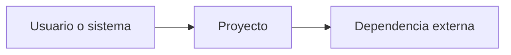
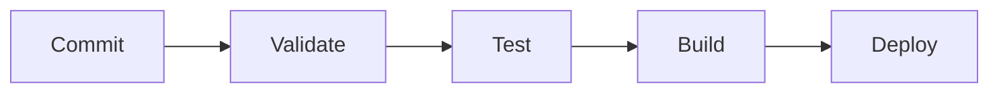

# Gravity HyperScale Thinking

## MASTER THINKING SEED

> **Propósito:** generar un snapshot técnico autosuficiente, verificable y portable de un proyecto de software. El resultado debe permitir que un modelo conversacional externo, sin acceso al IDE ni al repositorio, comprenda la intención, arquitectura, implementación, operación, estado actual, restricciones y brechas del proyecto con el menor nivel posible de ambigüedad.

---

# A. CONTRATO DE GENERACIÓN DEL SEED

## A.1 Rol del agente que genera esta semilla

Actúa como **Arquitecto de Software, Analista de Repositorios y Documentador Técnico**. Inspecciona el repositorio completo y construye una representación fiel de su estado actual.

No te limites a describir nombres de archivos. Debes inferir responsabilidades a partir de evidencia concreta, conectar componentes, identificar flujos y distinguir con claridad entre:

- hechos observados en el repositorio;
- inferencias razonables;
- convenciones esperadas, pero no verificadas;
- funcionalidades incompletas o ausentes;
- deuda técnica, riesgos y contradicciones.

## A.2 Objetivo de salida

Genera un único documento Markdown llamado `Seed.md`, apto para adjuntarse a cualquier modelo conversacional. Debe poder responder, como mínimo:

1. ¿Qué hace el proyecto y para quién?
2. ¿Qué problema resuelve y cuál es su alcance?
3. ¿Cómo está organizado el repositorio?
4. ¿Cómo se ejecuta el sistema de extremo a extremo?
5. ¿Qué componentes, datos, APIs y dependencias intervienen?
6. ¿Cómo se configura, prueba, despliega, monitorea y recupera?
7. ¿Cuál es el estado real de implementación?
8. ¿Qué falta, qué está bloqueado y qué riesgos existen?
9. ¿Qué reglas debe respetar cualquier cambio futuro?
10. ¿En qué archivos concretos debería trabajar un modelo para resolver una tarea?

## A.3 Alcance de inspección

Inspecciona recursivamente todo el proyecto, incluyendo cuando existan:

- código fuente;
- archivos de configuración;
- manifiestos y lockfiles;
- documentación y ADR;
- pruebas, fixtures y mocks;
- migraciones, esquemas y contratos;
- notebooks, SQL y pipelines;
- infraestructura como código;
- workflows de CI/CD;
- contenedores y scripts operativos;
- archivos de ejemplo de variables de entorno;
- artefactos de compilación relevantes;
- referencias a servicios externos;
- comentarios `TODO`, `FIXME`, `HACK`, `XXX` y código deshabilitado;
- historial Git, ramas o diffs disponibles, si el entorno permite consultarlos.

### Exclusiones predeterminadas

No leas ni reproduzcas contenido de directorios o archivos generados, binarios o de alto volumen, salvo que sean arquitectónicamente relevantes:

```text
.git/
node_modules/
.venv/
venv/
__pycache__/
dist/
build/
target/
coverage/
.next/
.cache/
*.pyc
*.class
*.dll
*.so
*.dylib
*.exe
*.bin
*.zip
*.tar
*.gz
```

Puedes registrar su existencia, tamaño o finalidad sin volcar su contenido.

## A.4 Seguridad y privacidad

Antes de escribir el Seed:

- **No expongas secretos**, tokens, contraseñas, claves privadas, connection strings completas ni datos personales.
- Sustituye valores sensibles por `<REDACTED>`.
- Conserva únicamente el **nombre de la variable**, su finalidad, obligatoriedad y formato esperado.
- Señala en `Security Findings` cualquier secreto potencialmente versionado, sin reproducirlo.
- No copies datasets completos, payloads sensibles ni información propietaria innecesaria.
- No ejecutes código, scripts, migraciones ni comandos destructivos solo para inspeccionar el proyecto.

## A.5 Método obligatorio de análisis

Sigue este orden:

1. Identifica raíz, tipo de repositorio y subproyectos.
2. Lee documentación y manifiestos principales.
3. Construye el árbol estructural excluyendo ruido.
4. Localiza entry points y flujos de ejecución.
5. Identifica configuración, contratos, persistencia e integraciones.
6. Revisa pruebas, automatización, despliegue y observabilidad.
7. Busca trabajo pendiente, inconsistencias y componentes huérfanos.
8. Contrasta documentación declarada contra implementación observada.
9. Genera el Seed con referencias a rutas concretas.
10. Realiza una verificación final de cobertura, seguridad y coherencia.

## A.6 Reglas de evidencia y honestidad epistemológica

Cada afirmación importante debe incluir una de estas etiquetas:

- **[CONFIRMADO]**: observado directamente en código o configuración.
- **[INFERIDO]**: deducido de varias señales, pero no declarado explícitamente.
- **[DECLARADO]**: aparece en documentación, aunque puede no coincidir con el código.
- **[NO VERIFICADO]**: requiere ejecución, acceso externo o información ausente.
- **[FALTANTE]**: componente esperado que no existe o no fue encontrado.

Para decisiones, flujos y hallazgos relevantes, agrega evidencia con rutas:

```text
Evidencia: src/api/main.py:42-88; config/settings.yaml; README.md#ejecucion
```

Si no puedes obtener números de línea, cita al menos la ruta y el símbolo, sección o clave correspondiente.

### Reglas contra alucinaciones

- No inventes archivos, endpoints, tablas, variables, comandos ni comportamientos.
- No presentes como funcional algo que solo está documentado o es un stub.
- Si hay contradicciones, registra ambas versiones y señala cuál prevalece en la implementación.
- Si una conclusión depende de ejecutar el sistema, márcala como **[NO VERIFICADO]**.
- Usa `No encontrado` en vez de completar vacíos con supuestos.

## A.7 Política de profundidad y presupuesto

Prioriza información estructural y accionable. Evita copiar archivos completos.

- Resume archivos rutinarios.
- Describe en mayor profundidad entry points, orquestadores, contratos, modelos, configuración, seguridad y componentes críticos.
- Incluye fragmentos de código únicamente cuando sean indispensables y limítalos a 10-20 líneas.
- Para repositorios grandes, documenta primero todos los módulos a nivel funcional y profundiza en el camino crítico.
- Si el documento supera un tamaño razonable, conserva el resumen ejecutivo y divide detalles en anexos dentro del mismo archivo.

---

# B. FORMATO OBLIGATORIO DEL SEED GENERADO

## 0. IDENTIDAD Y METADATOS

```yaml
seed_schema_version: "2.0"
project_name: "<nombre>"
repository_name: "<nombre>"
project_type: "<monolith|modular-monolith|microservices|library|data-platform|ml-system|frontend|mobile|infra|mixed|unknown>"
repository_mode: "<single-project|monorepo|multi-root>"
generated_at: "<ISO-8601 con zona horaria>"
generated_by: "<agente/modelo si está disponible>"
repository_root: "<ruta lógica, no sensible>"
git_branch: "<rama o unknown>"
git_commit: "<hash corto o unknown>"
working_tree_state: "<clean|dirty|unknown>"
analysis_mode: "<static|static+git|static+validated>"
coverage_level: "<high|medium|low>"
known_analysis_limits:
  - "<limitación>"
```

### 0.1 Instrucciones para el modelo receptor

Al recibir este Seed:

1. Trátalo como la fuente primaria de contexto del proyecto, no como prueba de ejecución.
2. Respeta las etiquetas de evidencia y no transformes inferencias en hechos.
3. Antes de proponer cambios, identifica módulos y archivos afectados.
4. Conserva arquitectura, convenciones, contratos y restricciones declaradas.
5. No inventes componentes ausentes. Formula preguntas solo cuando la incertidumbre impida una respuesta segura.
6. Cuando propongas código, indica explícitamente la ruta de cada archivo nuevo o modificado.
7. Evalúa impactos laterales en pruebas, configuración, datos, seguridad, observabilidad y despliegue.
8. Si la solicitud contradice el Seed, explica la contradicción y ofrece una alternativa compatible.
9. No reveles ni solicites secretos. Usa placeholders.
10. Distingue entre solución inmediata, deuda técnica y recomendación futura.

---

## 1. RESUMEN EJECUTIVO

### 1.1 Proyecto en una frase

`<Qué construye, para quién y con qué resultado>`

### 1.2 Objetivo principal

- **[ETIQUETA]** `<objetivo>`
- Evidencia: `<rutas>`

### 1.3 Problema que resuelve

Describe situación inicial, usuarios o sistemas afectados, resultado esperado y límites del problema.

### 1.4 Alcance

**Incluye:**
- `<capacidad>`

**No incluye / fuera de alcance:**
- `<capacidad>`

### 1.5 Estado actual resumido

- **Fase:** `<idea|prototipo|MVP|beta|producción|mantenimiento|migración|unknown>`
- **Operatividad estimada:** `<funcional|parcial|bloqueada|no verificada>`
- **Foco actual:** `<objetivo del ciclo actual>`
- **Mayor brecha:** `<brecha>`
- **Mayor riesgo:** `<riesgo>`

### 1.6 Capacidades principales

| Capacidad | Estado | Implementación principal | Evidencia |
|---|---|---|---|
| `<capacidad>` | `<completa|parcial|stub|planificada|desconocida>` | `<ruta/componente>` | `<ruta>` |

---

## 2. MANIFIESTO Y PRINCIPIOS DE DISEÑO

### 2.1 Principios arquitectónicos

Enumera decisiones que estructuran el proyecto, por ejemplo: desacoplamiento, idempotencia, event-driven, configuración externa, zero trust, separación de dominios o reproducibilidad.

### 2.2 Restricciones no negociables

- restricciones técnicas;
- compatibilidad;
- latencia, volumen o costo;
- residencia o clasificación de datos;
- requisitos de seguridad;
- limitaciones de proveedor;
- decisiones explícitamente descartadas.

### 2.3 Criterios de éxito

Incluye métricas o condiciones verificables. Si no existen, marca **[FALTANTE]**.

---

## 3. TOPOLOGÍA DEL REPOSITORIO

### 3.1 Vista general

Explica si es monorepo, repositorio simple o multi-root, y cómo se separan dominios, capas o servicios.

### 3.2 Árbol anotado

Incluye un árbol suficientemente completo para localizar cualquier componente relevante. Anota responsabilidades; no listes ruido generado.

```text
<repo>/
├── src/                  # Código productivo
│   └── ...
├── tests/                # Estrategia y tipos de pruebas
├── config/               # Configuración no secreta
└── ...
```

### 3.3 Catálogo de componentes

| Componente | Tipo | Responsabilidad | Entry point | Depende de | Consumido por | Madurez |
|---|---|---|---|---|---|---|
| `<nombre>` | `<service|library|job|ui|pipeline|infra>` | `<responsabilidad>` | `<ruta>` | `<componentes>` | `<componentes>` | `<estado>` |

### 3.4 Carpetas o nombres ambiguos

Explica diferencias entre carpetas similares, duplicadas, legacy o con responsabilidades poco evidentes.

### 3.5 Archivos críticos

| Ruta | Por qué es crítica | Qué la consume | Riesgo de cambio |
|---|---|---|---|
| `<ruta>` | `<motivo>` | `<consumidor>` | `<alto|medio|bajo>` |

### 3.6 Archivos generados y fuentes de verdad

Distingue claramente:

- archivos fuente editables;
- artefactos generados;
- archivos vendorizados;
- cachés;
- outputs de ejecución;
- archivos que no deben editarse manualmente.

---

## 4. ARQUITECTURA DEL SISTEMA

### 4.1 Patrón arquitectónico

Describe patrón global, capas, bounded contexts, componentes y fronteras de responsabilidad.

### 4.2 Diagrama de contexto



### 4.3 Diagrama de componentes

Incluye únicamente relaciones verificadas y marca las inferidas en etiquetas o notas.

### 4.4 Stack tecnológico

| Capa | Tecnología | Versión | Finalidad | Fuente de versión |
|---|---|---:|---|---|
| `<backend>` | `<tecnología>` | `<versión o rango>` | `<uso>` | `<manifest/lockfile>` |

### 4.5 Fronteras y acoplamientos

Describe interfaces internas, dependencias circulares, accesos cruzados y zonas de alto acoplamiento.

---

## 5. FLUJOS DE EJECUCIÓN

### 5.1 Entry points

| Escenario | Entry point | Comando o trigger | Resultado |
|---|---|---|---|
| `<API>` | `<ruta:símbolo>` | `<comando/evento>` | `<salida>` |

### 5.2 Flujo principal de extremo a extremo

Incluye pasos numerados y un diagrama Mermaid. Para cada paso indica:

- componente ejecutor;
- input y output;
- transformación o regla;
- persistencia;
- error esperado y manejo;
- evidencia.

### 5.3 Flujos alternativos

Documenta trabajos batch, workers, tareas programadas, webhooks, CLI, reintentos y rutas de fallback.

### 5.4 Ciclo de vida de datos y artefactos

Especifica dónde nacen, se validan, transforman, almacenan, publican, versionan y eliminan los datos.

### 5.5 Estado, concurrencia e idempotencia

Explica manejo de estado, transacciones, locks, deduplicación, reentrancia y garantías de entrega.

---

## 6. CONTRATOS E INTERFACES

### 6.1 APIs expuestas

| Método/Tipo | Ruta o tópico | Auth | Request | Response | Errores | Implementación |
|---|---|---|---|---|---|---|
| `<GET>` | `</v1/...>` | `<método>` | `<schema>` | `<schema>` | `<códigos>` | `<ruta>` |

### 6.2 APIs y servicios consumidos

| Sistema | Uso | Protocolo/SDK | Configuración | Timeout/Retry | Fallback |
|---|---|---|---|---|---|
| `<servicio>` | `<uso>` | `<tipo>` | `<env var>` | `<política>` | `<conducta>` |

### 6.3 Eventos, colas y mensajería

Documenta productores, consumidores, tópicos, schemas, ordering, delivery semantics y dead-letter queues.

### 6.4 Contratos de datos

| Entidad/Dataset | Propietario | Schema | Clave | Origen | Destino | Calidad/Validación |
|---|---|---|---|---|---|---|
| `<nombre>` | `<owner>` | `<ruta>` | `<clave>` | `<origen>` | `<destino>` | `<reglas>` |

### 6.5 Compatibilidad y versionado

Describe versionado de APIs, schemas, migraciones y criterios de backward compatibility.

---

## 7. PERSISTENCIA Y DATOS

### 7.1 Almacenes

| Almacén | Tecnología | Contenido | Acceso | Retención | Evidencia |
|---|---|---|---|---|---|
| `<nombre>` | `<DB/object store>` | `<datos>` | `<repositorio/cliente>` | `<política>` | `<ruta>` |

### 7.2 Modelo de datos

Resume entidades, relaciones, claves, índices, particiones y restricciones relevantes.

### 7.3 Migraciones y bootstrap

Indica herramienta, ubicación, orden, reversibilidad, seed data y procedimiento de inicialización.

### 7.4 Calidad, gobernanza y linaje

Documenta validaciones, ownership, clasificación, catálogo, lineage, PII y controles de acceso si aplican.

---

## 8. CONFIGURACIÓN Y ENTORNOS

### 8.1 Variables de configuración

Nunca incluyas valores secretos.

| Variable | Tipo | Requerida | Default seguro | Entornos | Efecto | Validación | Sensible |
|---|---|---:|---|---|---|---|---:|
| `<NAME>` | `<string>` | `<sí/no>` | `<valor o ninguno>` | `<dev/test/prod>` | `<efecto>` | `<regla>` | `<sí/no>` |

### 8.2 Precedencia de configuración

Describe orden efectivo, por ejemplo: argumentos CLI > variables de entorno > archivo > defaults.

### 8.3 Matriz de entornos

| Aspecto | Local | Testing | Staging | Producción |
|---|---|---|---|---|
| `<datos>` | `<config>` | `<config>` | `<config>` | `<config>` |

### 8.4 Feature flags

Registra nombre, finalidad, estado por defecto, dependencias y estrategia de retiro.

---

## 9. DEPENDENCIAS

### 9.1 Dependencias internas

Incluye grafo o lista de módulos y dirección de dependencia.

### 9.2 Dependencias externas críticas

| Dependencia | Versión | Uso | Criticidad | Riesgo/Restricción | Alternativa |
|---|---:|---|---|---|---|
| `<paquete/servicio>` | `<versión>` | `<uso>` | `<alta/media/baja>` | `<riesgo>` | `<alternativa>` |

### 9.3 Gestión y reproducibilidad

Describe lockfiles, registries, pinning, actualización, licencias, vulnerabilidades conocidas y artefactos privados.

### 9.4 Proyectos hermanos y ecosistema

Señala repositorios, librerías, pipelines o plataformas relacionadas. No inventes relaciones no verificadas.

---

## 10. DESARROLLO LOCAL

### 10.1 Prerrequisitos

Lista runtimes, versiones, herramientas, accesos y servicios requeridos.

### 10.2 Quick start verificable

```bash
# Comandos mínimos y no destructivos encontrados en el repositorio
<instalación>
<configuración>
<ejecución>
```

Marca los comandos como **[NO VERIFICADO]** si no fueron ejecutados.

### 10.3 Comandos operativos

| Objetivo | Comando | Directorio | Efectos secundarios | Verificado |
|---|---|---|---|---|
| `<test>` | `<comando>` | `<ruta>` | `<efecto>` | `<sí/no>` |

### 10.4 Convenciones de código

Incluye estilo, linting, tipado, nombres, estructura, manejo de errores, logging, commits y branching si están definidos.

### 10.5 Guía de cambios

Explica dónde agregar una nueva feature, endpoint, entidad, pipeline, prueba y configuración sin romper las fronteras existentes.

---

## 11. TESTING Y CALIDAD

### 11.1 Estrategia de pruebas

| Tipo | Ubicación | Framework | Qué cubre | Cómo ejecutar | Estado |
|---|---|---|---|---|---|
| `<unit>` | `<ruta>` | `<tool>` | `<cobertura>` | `<comando>` | `<activo/parcial/ausente>` |

### 11.2 Cobertura crítica

Indica caminos cubiertos, no cubiertos y pruebas frágiles. No inventes porcentajes.

### 11.3 Datos de prueba

Describe fixtures, factories, mocks, golden files, anonimización y aislamiento.

### 11.4 Quality gates

Documenta lint, formato, type checking, análisis estático, coverage gates y reglas de merge.

---

## 12. BUILD, RELEASE Y DESPLIEGUE

### 12.1 Build y empaquetado

Describe inputs, outputs, herramientas, versionado y artefactos.

### 12.2 CI/CD



Detalla triggers, jobs, gates, secretos referenciados, promociones y rollback.

### 12.3 Infraestructura

Documenta cloud, cuentas/proyectos lógicos, regiones, redes, cómputo, storage, identidades e IaC sin exponer identificadores sensibles.

### 12.4 Release y rollback

Incluye estrategia, migraciones, compatibilidad, canary/blue-green si existe y procedimiento de recuperación.

---

## 13. OPERACIÓN Y OBSERVABILIDAD

### 13.1 Logging

Formato, niveles, correlation IDs, destinos y política sobre datos sensibles.

### 13.2 Métricas, trazas y alertas

| Señal | Instrumentación | Destino | Umbral/SLO | Acción |
|---|---|---|---|---|
| `<métrica>` | `<ruta/tool>` | `<plataforma>` | `<regla>` | `<respuesta>` |

### 13.3 Health checks y readiness

Documenta endpoints, probes, dependencias verificadas y condiciones de disponibilidad.

### 13.4 Runbooks y operación

Incluye procedimientos conocidos para incidentes, reprocess, limpieza, rotación, recuperación y soporte.

---

## 14. SEGURIDAD

### 14.1 Modelo de autenticación y autorización

Describe identidades, roles, permisos, fronteras de confianza y service principals sin exponer secretos.

### 14.2 Manejo de secretos

Indica proveedor, mecanismo de inyección, rotación y archivos que solo documentan nombres de variables.

### 14.3 Superficie de ataque y controles

Revisa validación de entrada, CORS, SSRF, SQL injection, command execution, path traversal, deserialización, supply chain y exposición de datos según corresponda.

### 14.4 Security Findings

| Severidad | Hallazgo | Evidencia | Impacto | Remediación sugerida |
|---|---|---|---|---|
| `<crítica/alta/media/baja>` | `<sin reproducir secretos>` | `<ruta>` | `<impacto>` | `<acción>` |

Aclara que el análisis estático no sustituye una auditoría de seguridad.

---

## 15. ESTADO REAL DEL PROYECTO

### 15.1 Matriz de implementación

| Área | Declarado | Observado | Estado real | Evidencia | Próximo paso |
|---|---|---|---|---|---|
| `<área>` | `<documentación>` | `<código>` | `<completo/parcial/stub/ausente>` | `<ruta>` | `<acción>` |

### 15.2 Trabajo pendiente detectado

| Prioridad | Pendiente | Fuente | Dependencias | Criterio de cierre |
|---|---|---|---|---|
| `<P0-P3>` | `<tarea>` | `<TODO/issue/doc/inferencia>` | `<bloqueos>` | `<resultado verificable>` |

### 15.3 TODO, FIXME, HACK y código muerto

Agrupa hallazgos por componente. No listes comentarios irrelevantes.

### 15.4 Bloqueadores e incertidumbres

Enumera accesos faltantes, dependencias externas, configuración ausente, decisiones abiertas y elementos que no pueden validarse estáticamente.

### 15.5 Deuda técnica

Prioriza impacto, probabilidad, costo aproximado relativo y recomendación.

---

## 16. MODOS DE FALLA Y RECUPERACIÓN

| Falla | Síntoma | Causa probable | Detección | Respuesta actual | Recuperación | Riesgo residual |
|---|---|---|---|---|---|---|
| `<falla>` | `<síntoma>` | `<causa>` | `<señal>` | `<manejo>` | `<pasos>` | `<riesgo>` |

Incluye errores de red, datos inválidos, timeouts, rate limits, indisponibilidad, duplicados, corrupción, despliegue y migración cuando apliquen.

---

## 17. DECISIONES Y EVOLUCIÓN

### 17.1 Decisiones registradas

| ID | Decisión | Motivo | Alternativas | Consecuencia | Estado | Evidencia |
|---|---|---|---|---|---|---|
| `<ADR-001>` | `<decisión>` | `<motivo>` | `<alternativas>` | `<trade-off>` | `<aceptada/superseded>` | `<ruta>` |

### 17.2 Decisiones inferidas

Registra decisiones visibles en el código, pero no documentadas explícitamente, siempre con etiqueta **[INFERIDO]**.

### 17.3 Preguntas abiertas

Formula preguntas concretas cuya respuesta cambiaría arquitectura, implementación o prioridad.

---

## 18. REGLAS PARA FUTURAS RESPUESTAS Y CAMBIOS

Todo modelo que use este Seed debe:

1. Responder alineado con el stack y patrones existentes.
2. Citar rutas del repositorio al justificar propuestas.
3. Indicar archivos a crear, modificar o eliminar.
4. Explicar impacto en contratos, datos, configuración, pruebas, seguridad y despliegue.
5. Evitar refactors amplios si la tarea puede resolverse localmente.
6. No introducir dependencias sin justificar compatibilidad, costo y mantenimiento.
7. Mantener backward compatibility salvo autorización explícita.
8. Proponer pruebas y criterios de aceptación para cada cambio.
9. Marcar supuestos e incertidumbres.
10. Separar claramente diagnóstico, solución recomendada y pasos de implementación.

### 18.1 Formato recomendado para responder solicitudes

```markdown
## Entendimiento de la solicitud
## Componentes afectados
## Supuestos e incertidumbres
## Solución propuesta
## Archivos a modificar
## Implementación
## Pruebas y validación
## Riesgos y rollback
## Criterios de aceptación
```

---

## 19. GLOSARIO DEL DOMINIO

| Término | Definición en este proyecto | No confundir con | Evidencia |
|---|---|---|---|
| `<término>` | `<definición>` | `<distinción>` | `<ruta>` |

---

## 20. ÍNDICE DE EVIDENCIAS

Lista las fuentes principales revisadas y su relevancia.

| Ruta | Tipo | Relevancia | Último estado observado |
|---|---|---|---|
| `<ruta>` | `<manifest/código/doc/test/config>` | `<qué demuestra>` | `<vigente/legacy/desconocido>` |

---

## 21. RESUMEN DE CONFIANZA Y COBERTURA

### 21.1 Cobertura del análisis

| Área | Cobertura | Confianza | Motivo de limitación |
|---|---|---|---|
| Arquitectura | `<alta/media/baja>` | `<alta/media/baja>` | `<motivo>` |
| Ejecución | `<...>` | `<...>` | `<...>` |
| Datos | `<...>` | `<...>` | `<...>` |
| Testing | `<...>` | `<...>` | `<...>` |
| Despliegue | `<...>` | `<...>` | `<...>` |
| Seguridad | `<...>` | `<...>` | `<...>` |

### 21.2 Hechos esenciales que un modelo no debe perder

Enumera entre 5 y 15 hechos de máxima importancia para trabajar correctamente en el proyecto.

### 21.3 Principales incertidumbres

Enumera las incertidumbres que podrían invalidar recomendaciones futuras.

---

# C. CONTROL DE CALIDAD ANTES DE GUARDAR

Antes de escribir `Seed.md`, verifica:

- [ ] El proyecto y su problema pueden explicarse sin acceso al repositorio.
- [ ] El árbol permite localizar todos los componentes relevantes.
- [ ] Los entry points y el flujo principal están identificados.
- [ ] Se diferencian hechos, declaraciones, inferencias y faltantes.
- [ ] Cada afirmación crítica tiene evidencia por ruta.
- [ ] Se documentaron configuración, contratos, persistencia e integraciones.
- [ ] Se comparó lo documentado con lo realmente implementado.
- [ ] Se registraron pruebas, despliegue, observabilidad y seguridad.
- [ ] Se identificaron brechas, bloqueadores, deuda y modos de falla.
- [ ] No hay secretos ni datos sensibles expuestos.
- [ ] No se inventaron comandos, archivos o funcionalidades.
- [ ] Las instrucciones para el modelo receptor son claras.
- [ ] Las rutas son relativas al repositorio y usan `/` como separador.
- [ ] Los diagramas son coherentes con las descripciones.
- [ ] El documento tiene fecha, commit y limitaciones del análisis.

---

# D. ACTUALIZACIÓN INCREMENTAL DEL SEED

Si ya existe un `Seed.md`:

1. No lo sobrescribas ciegamente.
2. Compara commit, árbol, manifiestos, contratos, entry points y configuración.
3. Conserva información todavía vigente.
4. Elimina o marca como obsoleta la información contradicha por el repositorio.
5. Actualiza estados, evidencias, riesgos y cobertura.
6. Agrega al inicio un changelog breve:

```markdown
## Seed Changelog
- `<fecha>`: `<cambio estructural o funcional detectado>`
- `<fecha>`: `<sección actualizada y motivo>`
```

7. Si no hay acceso a Git, indica que la comparación se hizo solo contra el contenido disponible.

---

# E. BLOQUE FINAL PARA EL MODELO RECEPTOR

```markdown
## CONTEXT HANDOFF

Este documento es un snapshot del proyecto, no el repositorio mismo. Responde usando sus evidencias y limitaciones.

Antes de resolver una solicitud:
1. identifica el objetivo;
2. localiza los componentes afectados;
3. revisa restricciones y contratos;
4. explicita supuestos;
5. propone cambios por archivo;
6. añade pruebas, riesgos y criterios de aceptación.

Si falta información crítica, realiza preguntas dirigidas. Si la información faltante no bloquea el trabajo, continúa con supuestos explícitos y una solución conservadora.
```
