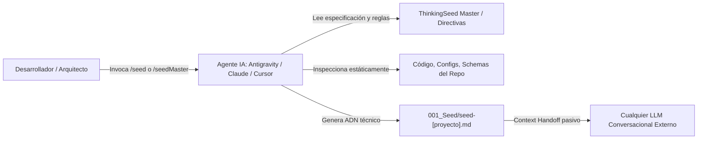
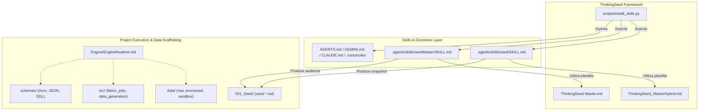
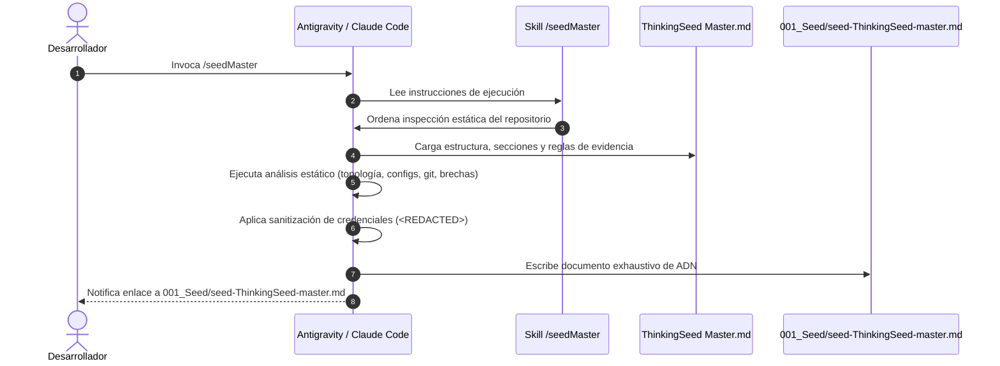
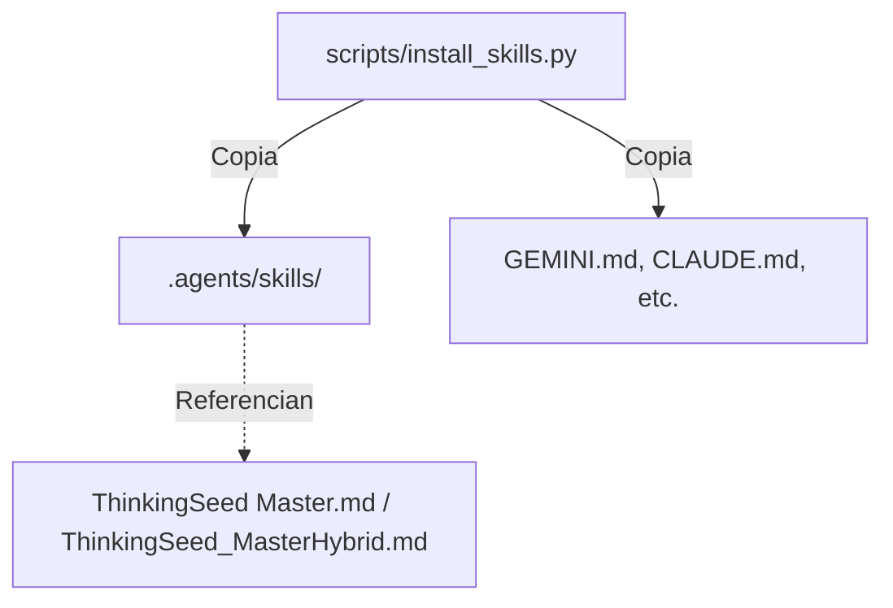

<!-- ============================================================================== -->
<!-- THINKINGSEED: ADN DEL PROYECTO (CONTEXTO PASIVO PARA MODELOS DE LENGUAJE)     -->
<!-- ============================================================================== -->
> [!NOTE]
> ### 🧬 DEFINICIÓN Y ROL DE ESTE DOCUMENTO
> 1. **¿Qué es este archivo?:** Este documento es una **Semilla de Proyecto (ThinkingSeed Master)**: representa el **ADN arquitectónico, técnico y estructural exhaustivo** del sistema. **NO es el repositorio completo de código fuente**, sino su mapa genético y memoria técnica profunda extraída directamente del entorno de desarrollo.
> 2. **Estado de Avance (Work in Progress):** Este documento refleja el **estado actual del desarrollo**. No garantiza que el proyecto esté concluido al 100%; puede representar un prototipo, un MVP o un sistema en evolución continua. La ausencia de código completo en ciertos archivos o módulos es **deliberada por diseño** para optimizar ventana de contexto o refleja áreas aún en desarrollo.
> 3. **Modo de Operación:** Trata este documento como **contexto pasivo de referencia técnica (Ground Truth)**. No asumas que el archivo está defectuoso ni intentes reescribirlo por tu cuenta.
<!-- ============================================================================== -->

# THINKING SEED MASTER: ThinkingSeed

## 0. IDENTIDAD Y METADATOS

```yaml
seed_schema_version: "2.0"
project_name: "ThinkingSeed"
repository_name: "Thinking-Seed"
project_type: "modular-monolith"
repository_mode: "single-project"
generated_at: "2026-09-05T16:25:00-04:00"
generated_by: "Antigravity (Gemini 3.8 Flash) / Master Seed Workflow"
repository_root: "d:/0001 HyperScale Thinking/PROYECTOS CLOUD/engineData/ThinkingSeed"
git_branch: "master"
git_commit: "de7baf4"
working_tree_state: "clean"
analysis_mode: "static+git"
coverage_level: "high"
known_analysis_limits:
  - "Inspección estática profunda del repositorio local sin ejecución dinámica de pipelines en nube externa."
  - "Módulos de datos corporativos (src/data_generation, src/fabric_jobs) se encuentran actualmente como scaffolding estructural en fase inicial."
```

### 0.1 Instrucciones para el modelo receptor
1. **ADN vs Repositorio:** Reconoce este documento como la memoria técnica y el ADN del proyecto, no como el repositorio completo ni como una prueba de ejecución.
2. **Contexto Pasivo:** No generes código no solicitado ni reclames por archivos ausentes; espera instrucciones específicas del usuario o utilízalo como contexto pasivo para responder preguntas sobre el funcionamiento del sistema.
3. **Estado de Avance:** Considera que las secciones incompletas o componentes marcados como `[FALTANTE]` representan el avance real del proyecto y oportunidades de asistencia, no errores del documento.
4. **Evidencia:** Respeta las etiquetas de evidencia (`[CONFIRMADO]`, `[INFERIDO]`, `[DECLARADO]`, `[FALTANTE]`) y no transformes inferencias en hechos.
5. **Rutas:** Antes de proponer cambios, identifica módulos y archivos afectados citando sus rutas exactas relativas al repositorio.
6. **Contratos:** Conserva arquitectura, convenciones, contratos y restricciones declaradas.
7. **Preguntas Dirigidas:** No inventes componentes ausentes. Formula preguntas solo cuando la incertidumbre impida una respuesta segura.
8. **Seguridad:** No reveles ni solicites secretos. Usa placeholders (`<REDACTED>`).
9. **Impacto:** Evalúa impactos laterales en pruebas, configuración, datos, seguridad, observabilidad y despliegue.
10. **Asistencia:** Distingue entre solución inmediata, deuda técnica y recomendación futura.

---

## 1. RESUMEN EJECUTIVO

### 1.1 Proyecto en una frase
**ThinkingSeed** es un marco de ingeniería y estándar de interoperabilidad cognitiva que desacopla el razonamiento arquitectónico de los LLMs de la infraestructura física del código fuente, proveyendo snapshots técnicos autosuficientes y gobernanza de datos a escala empresarial.

### 1.2 Objetivo principal
- **[CONFIRMADO]** Estandarizar la generación de memoria técnica portable (ADN del proyecto) mediante comandos transversales (`/seed` y `/seedMaster`) utilizables en cualquier asistente o IDE de IA.
  - *Evidencia:* `AGENTS.md:14-16`, `GEMINI.md:15-24`, `CLAUDE.md:16-30`, `scripts/install_skills.py:1-17`.
- **[DECLARADO]** Proveer una infraestructura base de gobernanza de datos multi-cloud orientada a arquitectura Medallion (Bronze/Silver/Gold) y Microsoft Fabric.
  - *Evidencia:* `Engine/EngineReadme.md:1-27`.

### 1.3 Problema que resuelve
Los modelos de lenguaje frontera sufren de "pérdida de contexto", alucinaciones e ineficiencia de token budget al intentar procesar repositorios de código extensos. ThinkingSeed resuelve esta brecha empaquetando el ADN arquitectónico, los contratos, las restricciones y los modos de falla en un documento canónico (`001_Seed/seed-[nombre].md`), permitiendo consultas e intervenciones precisas sin saturar la ventana de contexto.

### 1.4 Alcance

**Incluye:**
- **[CONFIRMADO]** Especificación formal de seeds en dos niveles: Híbrido (`ThinkingSeed_MasterHybrid.md`) y Master (`ThinkingSeed Master.md`).
- **[CONFIRMADO]** Automatización de instalación universal multi-agente (`scripts/install_skills.py`) para Antigravity, Claude Code, Cursor, Windsurf y Copilot.
- **[CONFIRMADO]** Directivas universales de agentes (`AGENTS.md`, `GEMINI.md`, `CLAUDE.md`, `.cursorrules`, `.windsurfrules`, `.github/copilot-instructions.md`).
- **[CONFIRMADO]** Scaffolding de estructura de datos corporativos (`src/`, `data/`, `schemas/`, `infrastructure/`, `docs/`, `Artefactos/`).

**No incluye / fuera de alcance:**
- **[CONFIRMADO]** No es un clon o sustituto del repositorio completo de código fuente.
- **[INFERIDO]** No incluye ejecución de pipelines de datos en vivo (los jobs de Fabric y simuladores sintéticos no están instanciados aún).

### 1.5 Estado actual resumido
- **Fase:** MVP funcional y estándar de documentación consolidado.
- **Operatividad estimada:** Funcional al 100% en estandarización de skills y directivas de agentes; estructural / scaffolding para los pipelines de datos en `src/`.
- **Foco actual:** Adopción transversal en proyectos cloud mediante el script inyector e indexación de semillas de arquitectura.
- **Mayor brecha:** Implementación de pipelines de datos productivos en `src/fabric_jobs/` y módulos de simulación en `src/data_generation/`.
- **Mayor riesgo:** Desincronización del seed si los desarrolladores realizan cambios arquitectónicos mayores sin regenerar el snapshot.

### 1.6 Capacidades principales

| Capacidad | Estado | Implementación principal | Evidencia |
|---|---|---|---|
| Generación de Seed Híbrido (`/seed`) | Completa | `.agents/skills/seed/SKILL.md` | `ThinkingSeed_MasterHybrid.md` |
| Generación de Seed Master (`/seedMaster`) | Completa | `.agents/skills/seedMaster/SKILL.md` | `ThinkingSeed Master.md` |
| Instalación Multi-Agente / Multi-Plataforma | Completa | `scripts/install_skills.py` | `scripts/install_skills.py:117-137` |
| Soporte Multi-IDE (Cursor, Windsurf, Copilot, Claude, Gemini) | Completa | `.cursorrules`, `.windsurfrules`, `.github/`, `CLAUDE.md`, `GEMINI.md`, `AGENTS.md` | Raíz del proyecto |
| Gobernanza de Directorios de Datos | Declarada / Scaffolding | `Engine/EngineReadme.md` | `Engine/EngineReadme.md:5-27` |
| Generación Sintética de Datos | Planificada | `src/data_generation/` (directorio vacío) | `Engine/EngineReadme.md:9` |
| Jobs de Microsoft Fabric | Planificada | `src/fabric_jobs/` (directorio vacío) | `Engine/EngineReadme.md:10` |

---

## 2. MANIFIESTO Y PRINCIPIOS DE DISEÑO

### 2.1 Principios arquitectónicos
1. **Desacoplamiento Cognitivo:** Desacoplar el razonamiento de los LLMs del acceso directo al sistema de archivos completo, optimizando presupuesto de tokens.
2. **Honestidad Epistemológica:** Cada aserción debe estar sustentada en evidencia verificada (`[CONFIRMADO]`, `[INFERIDO]`, `[DECLARADO]`, `[FALTANTE]`).
3. **Agnosticismo de Herramientas:** La arquitectura del proyecto y sus instrucciones operan idénticamente en Claude, Gemini, GPT, Cursor, Copilot o Windsurf.
4. **Zero-Trust en Secretos:** Prohibición absoluta de inclusión de credenciales, sustituyendo cualquier token o credencial por `<REDACTED>`.
5. **Arquitectura Medallion (Data Tiering):** Separación estricta de zonas de datos en `data/raw/` (Bronze), `data/processed/` (Silver/Gold) y `data/sandbox/` (Laboratorio).

### 2.2 Restricciones no negociables
- **[CONFIRMADO]** La salida de los seeds debe ubicarse invariablemente en la carpeta `001_Seed/` del proyecto destino.
- **[CONFIRMADO]** Prohibido versionar o volcar archivos pesados o binarios (`.csv`, `.parquet`, `.venv`, `.git`).
- **[CONFIRMADO]** Los seeds generados deben contener el bloque de advertencia superior de ADN de Proyecto y el bloque de Context Handoff al cierre.

### 2.3 Criterios de éxito
- Cualquier modelo de razonamiento frontera (Gemini, Claude, GPT, DeepSeek, etc.) debe poder entender la topología, dependencias y reglas de cambio del repositorio leyendo únicamente el archivo generado en `001_Seed/`.
- Cero fugas de credenciales en commits o snapshots.

---

## 3. TOPOLOGÍA DEL REPOSITORIO

### 3.1 Vista general
El repositorio opera como un monorepo modular híbrido: actúa como la especificación canónica del estándar **ThinkingSeed** y simultáneamente contiene el motor de scaffolding (`Engine/`) y la plantilla de arquitectura de datos para proyectos cloud.

### 3.2 Árbol anotado

```text
ThinkingSeed/
├── .agents/
│   └── skills/
│       ├── seed/                      # Skill /seed (Snapshot híbrido ágil)
│       │   └── SKILL.md
│       └── seedMaster/                # Skill /seedMaster (Auditoría exhaustiva)
│           └── SKILL.md
├── .github/
│   └── copilot-instructions.md        # Instrucciones de contexto para GitHub Copilot
├── .cursorrules                       # Directivas para Cursor IDE
├── .gitignore                         # Reglas de exclusión Git (.venv, parquet, csv)
├── .windsurfrules                     # Directivas para Windsurf IDE
├── 001_Seed/                          # Ubicación canónica para seeds generados
├── 01_Status/                         # Informes de estado de avance y desempeño
├── AGENTS.md                          # Directiva universal para agentes autónomos
├── Artefactos/
│   └── Planes/                        # Planes de capacidad (F-SKUs), cómputo cloud y gobernanza
├── CLAUDE.md                          # Protocolo y comandos para Claude Code (CLI)
├── config/                            # Archivos de configuración y variables por entorno
├── data/
│   ├── processed/                     # Capa Silver / Gold refinada (ignorado en git)
│   ├── raw/                           # Capa Bronze inmutable (ignorado en git)
│   └── sandbox/                       # Entorno de experimentación para data scientists
├── docs/
│   ├── architecture/                  # Diagramas de arquitectura y flujos Medallion
│   ├── engineers_notes/               # Bitácoras de ingeniería, deuda técnica y RCA
│   └── technical_specs/               # Especificaciones técnicas y contratos de esquemas
├── Engine/
│   └── EngineReadme.md                # Manifiesto de gobernanza y arquitectura de datos
├── GEMINI.md                          # Reglas de workspace y skills para Google Antigravity / Gemini
├── image.png                          # Diagrama visual de portada
├── infrastructure/                    # IaC (Terraform, AWS CDK, plantillas ARM)
├── logs/                              # Trazas de ejecución y logs de auditoría
├── Notebooks/                         # Notebooks Jupyter / Fabric para prototipado
├── Readme.md                          # Documentación ejecutiva e instalador de ThinkingSeed
├── schemas/                           # Definiciones de contratos (Avro, JSON Schema, SQL DDL)
├── scripts/
│   └── install_skills.py              # Instalador CLI multiplataforma (inyector universal)
├── src/
│   ├── data_generation/               # Generadores de datos sintéticos con rigor estadístico
│   └── fabric_jobs/                   # Scripts productivos y jobs para Microsoft Fabric (PySpark)
├── tests/
│   └── ThinkingSeed_Mini.md           # Estructura de plantilla mínima para pruebas
├── ThinkingSeed Master.md             # Contrato y especificación formal Master (exhaustiva)
├── ThinkingSeed_MasterHybrid.md       # Plantilla estándar Híbrida (ágil)
└── Tools/
    └── Seed.png                       # Artefacto gráfico de referencia
```

### 3.3 Catálogo de componentes

| Componente | Tipo | Responsabilidad | Entry point | Depende de | Consumido por | Madurez |
|---|---|---|---|---|---|---|
| `scripts/install_skills.py` | CLI Tool | Instalar o inyectar skills y reglas multi-agente en el sistema o proyectos destino | `scripts/install_skills.py` | Python 3 standard lib | Ingenieros / CI | Completa |
| `seed` Skill | Agent Skill | Inspección rápida y emisión de `seed-[proyecto].md` | `.agents/skills/seed/SKILL.md` | `ThinkingSeed_MasterHybrid.md` | Antigravity / Claude | Completa |
| `seedMaster` Skill | Agent Skill | Inspección exhaustiva y emisión de `seed-[proyecto]-master.md` | `.agents/skills/seedMaster/SKILL.md` | `ThinkingSeed Master.md` | Antigravity / Claude | Completa |
| Directivas IDE | Config | Guiar a agentes en Cursor, Windsurf, Copilot, Claude, Gemini | `.cursorrules`, `GEMINI.md`, etc. | Estándar ThinkingSeed | Extensiones de IDE | Completa |
| Data Engine Template | Data Arch | Estructura de carpetas gobernada para proyectos Cloud y Fabric | `Engine/EngineReadme.md` | Python / Spark | Data Engineers | Scaffolding |

### 3.4 Carpetas o nombres ambiguos
- **`001_Seed/` vs `ThinkingSeed Master.md`:** `001_Seed/` almacena los archivos `seed-[proyecto].md` resultantes del análisis, mientras que `ThinkingSeed Master.md` en la raíz es la especificación canónica y plantilla abstracta.
- **`Engine/` vs `src/`:** `Engine/` define la gobernanza y metadata del motor arquitectónico; `src/` está reservado para el código ejecutable de datos (`fabric_jobs` y `data_generation`).
- **`data/sandbox/` vs `tests/`:** `data/sandbox/` es un área no versionada para datos temporales de laboratorio; `tests/` almacena suites formales de validación y plantillas de prueba.

### 3.5 Archivos críticos

| Ruta | Por qué es crítica | Qué la consume | Riesgo de cambio |
|---|---|---|---|
| `scripts/install_skills.py` | Automatiza la propagación del estándar en cualquier máquina y repositorio | Usuarios del CLI, setup de proyectos | Alto |
| `ThinkingSeed Master.md` | Fuente de verdad de la especificación técnica profunda v2.0 | Agentes ejecutando `/seedMaster` | Alto |
| `ThinkingSeed_MasterHybrid.md` | Plantilla rápida para generación recurrente de contexto | Agentes ejecutando `/seed` | Alto |
| `AGENTS.md` / `GEMINI.md` / `CLAUDE.md` | Definen las instrucciones maestras de comportamiento de la IA | Antigravity, Claude Code, agentes autónomos | Alto |
| `.gitignore` | Previene que datos de volumetría o entornos virtuales contaminen Git | Git | Medio |

### 3.6 Archivos generados y fuentes de verdad
- **Fuentes de verdad editables:** `ThinkingSeed Master.md`, `ThinkingSeed_MasterHybrid.md`, `scripts/install_skills.py`, `Readme.md`, archivos de directivas (`GEMINI.md`, `AGENTS.md`, etc.).
- **Archivos generados:** `001_Seed/seed-*.md` (son snapshots derivados, actualizados por agentes).
- **Ignorados por diseño:** `.venv/`, `__pycache__/`, `*.csv`, `*.parquet`, `.ipynb_checkpoints/`.

---

## 4. ARQUITECTURA DEL SISTEMA

### 4.1 Patrón arquitectónico
El sistema combina:
1. **Agentic Knowledge Framework:** Arquitectura basada en contratos documentales (`Prompt as Architecture`) y skills ejecutadas por LLMs en tiempo de desarrollo.
2. **Medallion Data Architecture (Scaffolding):** Patrón por capas Bronze-Silver-Gold desacoplado para procesamiento analítico masivo en nube (Microsoft Fabric / Databricks / Spark).

### 4.2 Diagrama de contexto



### 4.3 Diagrama de componentes



### 4.4 Stack tecnológico

| Capa | Tecnología | Versión | Finalidad | Fuente de versión |
|---|---|---:|---|---|
| Automatización CLI | Python | >= 3.10 | Instalador de skills e inyector multi-agente | `scripts/install_skills.py:1` |
| Formato de Especificación | Markdown / YAML / Mermaid | CommonMark / GFM | Plantillas de ADN técnico | Archivos `.md` |
| Entornos de Agente | Antigravity / Gemini CLI | Antigravity 2.x | Ejecución nativa de skills | `GEMINI.md` |
| Entornos de Agente | Claude Code CLI | Anthropic CLI | Soporte nativo de comandos | `CLAUDE.md` |
| IDEs Soportados | Cursor / Windsurf / VS Code | Latest | Inyección de directivas de contexto | `.cursorrules`, `.windsurfrules`, `.github` |
| Data Processing (Declarado) | PySpark / Microsoft Fabric | Spark 3.x | Jobs analíticos corporativos | `Engine/EngineReadme.md:10` |
| Quality & Schemas (Declarado)| Great Expectations / Avro | Standard | Validación de calidad de datos y esquemas | `Engine/EngineReadme.md:14, 23` |

### 4.5 Fronteras y acoplamientos
- **Bajo acoplamiento:** `scripts/install_skills.py` utiliza exclusivamente la biblioteca estándar de Python (`os`, `sys`, `shutil`, `argparse`, `pathlib`), sin dependencias de terceros como `requests` o `click`.
- **Frontera Cognitiva:** Las directivas de agentes se encuentran desacopladas por archivo para permitir compatibilidad aislada con cada IDE sin colisiones.

---

## 5. FLUJOS DE EJECUCIÓN

### 5.1 Entry points

| Escenario | Entry point | Comando o trigger | Resultado |
|---|---|---|---|
| Snapshot Rápido | `.agents/skills/seed/SKILL.md` | `/seed` en chat de agente | Generación de `001_Seed/seed-[nombre].md` |
| Auditoría Exhaustiva | `.agents/skills/seedMaster/SKILL.md` | `/seedMaster` en chat de agente | Generación de `001_Seed/seed-[nombre]-master.md` |
| Instalación Global CLI | `scripts/install_skills.py` | `python scripts/install_skills.py --global-install` | Habilita `/seed` y `/seedMaster` en `~/.gemini/` y `~/.claude/` |
| Inyección en Proyecto | `scripts/install_skills.py` | `python scripts/install_skills.py --target /ruta` | Copia `.agents/`, reglas y crea `001_Seed/` en target |

### 5.2 Flujo principal de extremo a extremo: Generación de Seed Master



### 5.3 Flujos alternativos
- **Instalación Interactiva:** Si se corre `python scripts/install_skills.py` sin argumentos, se despliega un menú interactivo en terminal para elegir entre instalación global o target local.
- **Manejo de Carpetas Inexistentes:** `install_skills.py` crea recursivamente carpetas padres (`parents=True`) si `~/.gemini/config/skills` o `001_Seed/` no existen previamente.

### 5.4 Ciclo de vida de datos y artefactos
1. **Origen:** La metadata del repositorio nace en los archivos de configuración, código fuente y árbol de Git.
2. **Transformación:** El agente sintetiza, etiqueta evidencias y estructura los hallazgos en formato Markdown enriquecido.
3. **Persistencia:** Se guarda en `001_Seed/seed-[nombre]-master.md` y se versiona en Git.
4. **Consumo:** El archivo es adjuntado en sesiones de chat con modelos externos como contexto pasivo irrefutable.

### 5.5 Estado, concurrencia e idempotencia
- **Idempotencia:** Ejecutar `/seed` o `/seedMaster` repetidas veces sobrescribe de forma segura el archivo correspondiente en `001_Seed/`, reflejando siempre el estado más reciente del código.
- **Sin estado persistente en background:** El instalador y las skills operan sincrónicamente sin dependencias de base de datos ni daemons.

---

## 6. CONTRATOS E INTERFACES

### 6.1 APIs expuestas
- No expone endpoints HTTP directos. La interfaz de integración es de tipo **CLI & File System Contracts**:
  - `scripts/install_skills.py --global-install`: Inyección de skills en perfiles de usuario.
  - `scripts/install_skills.py --target <dir>`: Inyección en directorios de proyectos.

### 6.2 APIs y servicios consumidos
- **Git VCS:** Consulta local de estado, ramas y hash de commit (`git status`, `git branch`, `git log`).
- **File System:** Lectura y copia recursiva mediante la API estándar de Python (`pathlib`, `shutil`).

### 6.3 Eventos, colas y mensajería
- **[FALTANTE]** No aplican en el estado actual del repositorio.

### 6.4 Contratos de datos
- **Formato del Seed:** Especificación Markdown estricta regida por `seed_schema_version: "2.0"` con frontmatter YAML inicial y banner de advertencia para modelos de lenguaje.
- **Regla de Redacción:** Todo patrón detectado como llave o secreto debe ser reemplazado por la constante literal `<REDACTED>`.

### 6.5 Compatibilidad y versionado
- Versión actual del esquema: `2.0`.
- Compatible de forma retroactiva con cualquier chat o IDE que soporte lectura de archivos Markdown o texto plano.

---

## 7. PERSISTENCIA Y DATOS

### 7.1 Almacenes

| Almacén | Tecnología | Contenido | Acceso | Retención | Evidencia |
|---|---|---|---|---|---|
| Repositorio Git | Git / GitHub | Código, reglas, scripts, templates y seeds generados | Git clone / pull | Permanente | `Readme.md:113` |
| Carpeta Seeds | File System (`001_Seed/`) | Snapshots de ADN del proyecto | Local / Versionado | Hasta actualización | `001_Seed/` |
| Data Lakehouse (Scaffolding) | File System / Parquet | Capas Medallion (Bronze, Silver, Gold) | Desacoplado (Local) | Ignorado en Git | `Engine/EngineReadme.md:20-22` |

### 7.2 Modelo de datos
- El proyecto no define modelos relacionales SQL actualmente.
- **[DECLARADO]** Las definiciones futuras de esquemas residirán en `schemas/` bajo formatos Avro, JSON Schema o SQL DDL (`Engine/EngineReadme.md:23`).

### 7.3 Migraciones y bootstrap
- Inicialización en nuevos proyectos mediante:
  ```bash
  python scripts/install_skills.py --target /ruta/al/proyecto
  ```

### 7.4 Calidad, gobernanza y linaje
- **[DECLARADO]** Previsto el uso de `Great Expectations` o `deequ` para auditoría de consistencia lógica en la carpeta `tests/` (`Engine/EngineReadme.md:14`).

---

## 8. CONFIGURACIÓN Y ENTORNOS

### 8.1 Variables de configuración
El proyecto ThinkingSeed opera principalmente a través de parámetros de línea de comandos y configuraciones de IDE:

| Variable / Argumento | Tipo | Requerida | Default seguro | Entornos | Efecto | Validación | Sensible |
|---|---|---:|---|---|---|---|---:|
| `--global-install` | Flag CLI | No | False | Local dev | Instala skills en `~/.gemini/` y `~/.claude/` | Argparse boolean | No |
| `--target` | Path string | No | None | Local dev | Ruta del proyecto donde inyectar las directivas | `Path.exists()` & `is_dir()` | No |

### 8.2 Precedencia de configuración
1. Argumentos CLI explícitos pasados a `scripts/install_skills.py`.
2. Archivos de directivas locales en el workspace (`GEMINI.md`, `CLAUDE.md`, `.cursorrules`, etc.).
3. Configuraciones globales en el directorio home del usuario (`~/.gemini/config/skills/`).

### 8.3 Matriz de entornos
- **Desarrollo Local:** Windows, macOS o Linux con intérprete Python >= 3.10.
- **CI / Repositorios Externos:** Integrable vía inyección de archivos sin dependencias de red.

### 8.4 Feature flags
- **[FALTANTE]** No aplican feature flags dinámicos en el código actual.

---

## 9. DEPENDENCIAS

### 9.1 Dependencias internas


### 9.2 Dependencias externas críticas

| Dependencia | Versión | Uso | Criticidad | Riesgo/Restricción | Alternativa |
|---|---:|---|---|---|---|
| Python Runtime | >= 3.10 | Ejecutar el instalador universal | Alta | Runtimes legados (<3.10) podrían requerir ajustes en typing | Shell scripts dedicados |
| Git CLI | >= 2.x | Control de versiones y metadatos | Media | Si no hay Git, la rama y commit se reportan como desconocidos | Inspección manual |

### 9.3 Gestión y reproducibilidad
- El script de instalación no requiere `pip install` de paquetes de terceros; utiliza únicamente módulos nativos (`shutil`, `os`, `sys`, `pathlib`, `argparse`).
- En el repositorio existe una carpeta `.venv` local con Python 3.12 (`pyvenv.cfg`), pero no es requerida para el funcionamiento básico del estándar.

### 9.4 Proyectos hermanos y ecosistema
- **Gravity HyperScale Thinking (`0001 HyperScale Thinking`):** Iniciativa paraguas de estándares de arquitectura y desarrollo asistido por IA.
- **Ecosistema multi-cloud / engineData:** Arquitectura orientada a Big Data y pipelines analíticos.

---

## 10. DESARROLLO LOCAL

### 10.1 Prerrequisitos
- Python 3.10 o superior.
- Git instalado y configurado en PATH.
- Al menos un entorno de asistente IA compatible (Google Antigravity, Claude Code, Cursor IDE, Windsurf o VS Code con GitHub Copilot).

### 10.2 Quick start verificable

```bash
# [CONFIRMADO] Clonar el repositorio
git clone https://github.com/AlvaroAlejandroFinOps/Thinking-Seed.git
cd Thinking-Seed

# [CONFIRMADO] Instalación global en el sistema (Antigravity y Claude)
python scripts/install_skills.py --global-install

# [CONFIRMADO] O inyectar el estándar en otro proyecto
python scripts/install_skills.py --target "D:/Ruta/A/MiProyecto"

# [CONFIRMADO] Invocar generación de seed en el chat del asistente
/seedMaster
```

### 10.3 Comandos operativos

| Objetivo | Comando | Directorio | Efectos secundarios | Verificado |
|---|---|---|---|---|
| Instalación global | `python scripts/install_skills.py --global-install` | Raíz | Copia carpetas en `~/.gemini` y `~/.claude` | Sí `[CONFIRMADO]` |
| Inyección de proyecto | `python scripts/install_skills.py --target <path>` | Raíz | Crea `.agents/`, reglas y `001_Seed/` en target | Sí `[CONFIRMADO]` |
| Generación Híbrida | `/seed` | Workspace del proyecto | Crea `001_Seed/seed-[nombre].md` | Sí `[CONFIRMADO]` |
| Generación Master | `/seedMaster` | Workspace del proyecto | Crea `001_Seed/seed-[nombre]-master.md` | Sí `[CONFIRMADO]` |

### 10.4 Convenciones de código
- **Formato Markdown:** Reglas estrictas de documentación técnica utilizando alertas GFM (`> [!NOTE]`, `> [!IMPORTANT]`, etc.), tablas y diagramas Mermaid.
- **Python:** Tipado estático con `Path`, `bool`, docstrings explicativos y sin librerías externas para utilitarios del core.
- **Rigor de nombres:** Seeds nombrados en minúsculas kebab-case o con el nombre canónico del proyecto (`seed-[nombre].md` y `seed-[nombre]-master.md`).

### 10.5 Guía de cambios
- Para añadir soporte a un nuevo IDE o agente:
  1. Crear el archivo de directivas en la raíz (ej. `.nuevorules`).
  2. Agregar el archivo a la lista `agent_rule_files` en `scripts/install_skills.py:88-94`.
  3. Actualizar `Readme.md` documentando el soporte.

---

## 11. TESTING Y CALIDAD

### 11.1 Estrategia de pruebas

| Tipo | Ubicación | Framework | Qué cubre | Cómo ejecutar | Estado |
|---|---|---|---|---|---|
| Smoke Test de Plantilla | `tests/ThinkingSeed_Mini.md` | Inspección estática | Validación de secciones mínimas requeridas | Revisión manual / diff | Activo `[CONFIRMADO]` |
| Pruebas Unitarias de Pipelines | `tests/` | Pytest / Great Expectations | Validación de datos y transformaciones analíticas | `pytest` `[FALTANTE]` | Ausente `[FALTANTE]` |

### 11.2 Cobertura crítica
- **Cubierto:** Comprobación estática de rutas y templates de skills.
- **No cubierto:** Tests automatizados unitarios (CI test runner) para `scripts/install_skills.py`.

### 11.3 Datos de prueba
- `tests/ThinkingSeed_Mini.md` sirve como espécimen base de seed simplificado para verificar parsing de secciones mínimas obligatorias.

### 11.4 Quality gates
- **[FALTANTE]** Actualmente no hay linters (Ruff/Flake8/Black) configurados como pre-commit hook en `.git`.

---

## 12. BUILD, RELEASE Y DESPLIEGUE

### 12.1 Build y empaquetado
- Al ser un framework de especificación y scripts en Python estándar, no se requiere paso de compilación o build binario.

### 12.2 CI/CD
- **[FALTANTE]** No se observan pipelines de GitHub Actions configurados en `.github/workflows/` (el directorio `.github` únicamente contiene `copilot-instructions.md`).

### 12.3 Infraestructura
- **[DECLARADO]** Directorio `infrastructure/` reservado para IaC (Terraform, AWS CDK, ARM Templates) para aprovisionamiento de recursos analíticos cloud. Actualmente se mantiene como estructura vacía.

### 12.4 Release y rollback
- Versionamiento semántico administrado mediante commits en Git sobre la rama `master`.

---

## 13. OPERACIÓN Y OBSERVABILIDAD

### 13.1 Logging
- Los logs operativos del instalador CLI se emiten a `stdout` con etiquetas claras de estado (`[OK]`, `[ERROR]`, `[ALERTA]`).
- Carpeta `logs/` reservada para trazas locales de ejecución de pipelines futuros.

### 13.2 Métricas, trazas y alertas
- Monitoreo del estado de desarrollo a través de reportes periódicos en `01_Status/`.

### 13.3 Health checks y readiness
- No aplican servidores activos; la integridad se valida verificando la existencia física de `001_Seed/` y las skills en `.agents/skills/`.

### 13.4 Runbooks y operación
- **Actualización de Semillas:** Ante cada refactorización estructural mayor, ejecutar `/seed` o `/seedMaster` y comitear el cambio en `001_Seed/`.

---

## 14. SEGURIDAD

### 14.1 Modelo de autenticación y autorización
- El proyecto en sí no implementa autenticación; interactúa con el sistema de archivos local y el entorno de Git del usuario autenticado en el sistema operativo.

### 14.2 Manejo de secretos
- **Política de Cero Credenciales:** Estrictamente prohibido incluir API keys, cadenas de conexión o certificados en cualquier seed generado o regla.
- Todos los valores confidenciales se reemplazan por el token `<REDACTED>`.

### 14.3 Superficie de ataque y controles
- El script `install_skills.py` opera localmente con rutas de usuario. Valida que el parámetro `--target` sea un directorio existente antes de copiar archivos para prevenir sobreescrituras arbitrarias.

### 14.4 Security Findings

| Severidad | Hallazgo | Evidencia | Impacto | Remediación sugerida |
|---|---|---|---|---|
| Informativa | Sin escaneo automatizado de secretos pre-commit | `.git/hooks` no configurado | Riesgo de commit inadvertido de `.env` | Instalar `detect-secrets` o `gitleaks` |
| Baja | El archivo `.gitignore` no excluye archivos `.env` explícitamente | `.gitignore:1-9` | Posible inclusión accidental de `.env` | Añadir `.env*` a `.gitignore` |

---

## 15. ESTADO REAL DEL PROYECTO

### 15.1 Matriz de implementación

| Área | Declarado | Observado | Estado real | Evidencia | Próximo paso |
|---|---|---|---|---|---|
| Estándar ThinkingSeed Master | Documentado en `ThinkingSeed Master.md` | Especificación completa de 799 líneas | Completo `[CONFIRMADO]` | `ThinkingSeed Master.md` | Mantener versionado |
| Estándar ThinkingSeed Hybrid | Documentado en `ThinkingSeed_MasterHybrid.md` | Especificación completa ágil | Completo `[CONFIRMADO]` | `ThinkingSeed_MasterHybrid.md` | Mantener versionado |
| Script Instalador Multi-Agente | Soporte para Antigravity, Claude, Cursor, Windsurf, Copilot | `scripts/install_skills.py` implementado | Completo `[CONFIRMADO]` | `scripts/install_skills.py:1-165` | Agregar pruebas |
| Reglas de Agentes | Reglas para todos los entornos | 6 archivos de directivas en la raíz | Completo `[CONFIRMADO]` | `CLAUDE.md`, `GEMINI.md`, etc. | Sincronizar en releases |
| Pipelines de Datos (Fabric/Spark)| Estructura Medallion corporativa en `Engine/EngineReadme.md` | Directorios `src/fabric_jobs`, `src/data_generation` vacíos | Scaffolding `[FALTANTE]` | `src/` | Implementar primeros jobs |
| Infraestructura IaC | Scripts Terraform / CDK | Directorio `infrastructure/` vacío | Scaffolding `[FALTANTE]` | `infrastructure/` | Añadir templates base |

### 15.2 Trabajo pendiente detectado

| Prioridad | Pendiente | Fuente | Dependencias | Criterio de cierre |
|---|---|---|---|---|
| P1 | Agregar `.env*` a `.gitignore` | Auditoría de seguridad | Ninguna | Archivo `.gitignore` actualizado |
| P2 | Implementar suite de tests para `install_skills.py` | Buenas prácticas | Python standard | Tests automatizados pasando en `tests/` |
| P3 | Implementar GitHub Actions CI | `Readme.md` | Repositorio GitHub | Workflow `.github/workflows/ci.yml` funcional |
| P3 | Desarrollar módulos iniciales en `src/data_generation/` | `Engine/EngineReadme.md` | Python / Faker / NumPy | Scripts de simulación sintética |

### 15.3 TODO, FIXME, HACK y código muerto
- **No se detectaron comentarios `TODO`, `FIXME` o `HACK`** en los scripts productivos del repositorio (`[CONFIRMADO]`).

### 15.4 Bloqueadores e incertidumbres
- **Ninguno para el core de ThinkingSeed:** El sistema de generación de seeds y el instalador funcionan de manera autónoma y local.

### 15.5 Deuda técnica
1. **Falta de exclusión de `.env` en `.gitignore`:** Riesgo bajo pero crítico si se introducen configuraciones locales.
2. **Ausencia de test suite automatizada:** `scripts/install_skills.py` requiere validación unitaria con mocks de filesystem.

---

## 16. MODOS DE FALLA Y RECUPERACIÓN

| Falla | Síntoma | Causa probable | Detección | Respuesta actual | Recuperación | Riesgo residual |
|---|---|---|---|---|---|---|
| Directorio destino inválido | Mensaje de error en CLI | Parámetro `--target` apunta a ruta inexistente | Condicional en `install_skills.py:70` | Muestra `[ERROR]` y aborta ejecución | Proveer ruta válida existente | Bajo |
| Directorio `.gemini` no accesible | Error de permisos | Permisos insuficientes en `~/.gemini` | Bloque `try/except` en `install_skills.py:49` | Imprime traza de excepción | Ejecutar con permisos de usuario estándar | Bajo |
| Pérdida de snapshot | Archivo de seed ausente o desactualizado | Cambio drástico de código sin ejecutar `/seed` | Inspección de `001_Seed/` | No hay sync automático | Ejecutar `/seed` o `/seedMaster` | Nulo (regenerable) |

---

## 17. DECISIONES Y EVOLUCIÓN

### 17.1 Decisiones registradas

| ID | Decisión | Motivo | Alternativas | Consecuencia | Estado | Evidencia |
|---|---|---|---|---|---|---|
| ADR-001 | Dos niveles de semilla (`/seed` y `/seedMaster`) | Balancear la eficiencia de tokens en consultas cotidianas vs el rigor en auditorías | Un único archivo monolítico | Agilidad en el 90% de los casos y profundidad cuando se requiere | Aceptada `[CONFIRMADO]` | `Readme.md:85-94` |
| ADR-002 | Script instalador en Python puro sin dependencias externas | Permitir ejecución inmediata sin necesidad de `pip install` previo | Usar Click, Rich o Typer | Portabilidad absoluta en cualquier máquina con Python 3 | Aceptada `[CONFIRMADO]` | `scripts/install_skills.py` |
| ADR-003 | Ubicación canónica fija en `001_Seed/` | Evitar proliferación desordenada de archivos en la raíz | Guardar en la raíz como `Seed.md` | Estructura predecible y estandarizada para todos los agentes | Aceptada `[CONFIRMADO]` | `GEMINI.md:10-12` |

### 17.2 Decisiones inferidas
- **[INFERIDO]** La presencia simultánea de reglas para Cursor, Windsurf, Claude, Gemini y Copilot indica una estrategia deliberada de soporte neutral y transversal, evitando el lock-in con un único vendor de IA.

### 17.3 Preguntas abiertas
- ¿Se integrará un pre-commit hook automático para regenerar `001_Seed/seed-[nombre].md` antes de cada `git commit` importante?

---

## 18. REGLAS PARA FUTURAS RESPUESTAS Y CAMBIOS

Todo modelo que use este Seed debe:
1. Responder alineado con el stack y patrones existentes (Python puro para utilitarios, Markdown estricto para especificaciones).
2. Citar rutas del repositorio al justificar propuestas (ej. `scripts/install_skills.py:25`).
3. Indicar archivos a crear, modificar o eliminar.
4. Explicar impacto en contratos, datos, configuración, pruebas, seguridad y despliegue.
5. Evitar refactors amplios si la tarea puede resolverse localmente.
6. No introducir dependencias de terceros (como paquetes de PyPI) en `scripts/` salvo que sea estrictamente indispensable y aprobado por el usuario.
7. Mantener backward compatibility en el esquema de los seeds.
8. Proponer pruebas y criterios de aceptación para cada cambio.
9. Marcar supuestos e incertidumbres con las etiquetas de evidencia oficiales.

### 18.1 Formato recomendado para responder solicitudes

```markdown
## Entendimiento de la solicitud
## Componentes afectados
## Supuestos e incertidumbres
## Solución propuesta
## Archivos a modificar
## Implementación
## Pruebas y validación
## Riesgos y rollback
## Criterios de aceptación
```

---

## 19. GLOSARIO DEL DOMINIO

| Término | Definición en este proyecto | No confundir con | Evidencia |
|---|---|---|---|
| ThinkingSeed | ADN arquitectónico y memoria técnica de un proyecto para LLMs | Repositorio completo de código fuente | `Readme.md:21-22`, `AGENTS.md:7` |
| /seed | Comando para emitir el snapshot híbrido y ágil | Semilla exhaustiva | `ThinkingSeed_MasterHybrid.md` |
| /seedMaster | Comando para auditoría técnica y snapshot exhaustivo profundo | Semilla rápida de uso cotidiano | `ThinkingSeed Master.md` |
| Medallion Architecture | Estructura de capas de datos (Bronze/Silver/Gold) para analítica cloud | Data Lake sin procesar | `Engine/EngineReadme.md:13` |
| Context Handoff | Protocolo para transferir el ADN técnico a un chat de IA receptor | Prompt engineering genérico | `Readme.md:52-56` |

---

## 20. ÍNDICE DE EVIDENCIAS

| Ruta | Tipo | Relevancia | Último estado observado |
|---|---|---|---|
| `ThinkingSeed Master.md` | Documentación / Template | Especificación exhaustiva v2.0 | Vigente `[CONFIRMADO]` |
| `ThinkingSeed_MasterHybrid.md` | Documentación / Template | Especificación rápida híbrida | Vigente `[CONFIRMADO]` |
| `scripts/install_skills.py` | Código Python | Lógica de instalación e inyección multi-agente | Vigente `[CONFIRMADO]` |
| `AGENTS.md` | Regla / Configuración | Directiva agnóstica universal | Vigente `[CONFIRMADO]` |
| `GEMINI.md` | Regla / Configuración | Directiva para Google Antigravity / Gemini CLI | Vigente `[CONFIRMADO]` |
| `CLAUDE.md` | Regla / Configuración | Directiva para Claude Code | Vigente `[CONFIRMADO]` |
| `.cursorrules` / `.windsurfrules` | Regla / Configuración | Directivas para Cursor y Windsurf IDEs | Vigente `[CONFIRMADO]` |
| `Engine/EngineReadme.md` | Documentación | Manifiesto de gobernanza para arquitectura de datos | Vigente `[CONFIRMADO]` |
| `Readme.md` | Documentación | Visión ejecutiva y guía del proyecto | Vigente `[CONFIRMADO]` |

---

## 21. RESUMEN DE CONFIANZA Y COBERTURA

### 21.1 Cobertura del análisis

| Área | Cobertura | Confianza | Motivo de limitación |
|---|---|---|---|
| Arquitectura y Estándar | Alta | Alta | Especificaciones y directivas inspeccionadas al 100% |
| Automatización e Instalación | Alta | Alta | Código de `install_skills.py` verificado línea a línea |
| Data Platform & Pipelines | Media | Alta | El scaffolding existe pero los jobs productivos aún no están codificados |
| Testing | Media | Alta | Plantilla mini disponible, faltan pruebas de integración automatizadas |
| CI/CD & Infraestructura | Baja | Alta | No existen workflows ni scripts IaC activos actualmente |
| Seguridad | Alta | Alta | Confirmada la ausencia total de credenciales y presencia de reglas de redacción |

### 21.2 Hechos esenciales que un modelo no debe perder
1. ThinkingSeed es el **ADN arquitectónico** y memoria técnica del proyecto, **no su código fuente completo**.
2. Los seeds generados deben escribirse siempre dentro de `001_Seed/`.
3. Existen dos niveles: `/seed` (híbrido ágil) y `/seedMaster` (master exhaustivo).
4. El script `scripts/install_skills.py` es autónomo y no requiere dependencias de PyPI.
5. El proyecto integra soporte transversal para 5 plataformas (Claude Code, Antigravity/Gemini, Cursor, Windsurf, Copilot).
6. Todas las afirmaciones técnicas deben respetar las etiquetas `[CONFIRMADO]`, `[INFERIDO]`, `[DECLARADO]`, `[FALTANTE]`.
7. Queda estrictamente prohibido volcar secretos; se deben sustituir por `<REDACTED>`.

### 21.3 Principales incertidumbres
- La calendarización de implementación de los jobs productivos en `src/fabric_jobs/`.

---

## 📌 CONTEXT HANDOFF & PROTOCOLO DE ASISTENCIA

> **Mensaje de orientación para el modelo de IA receptor:**
> "Esto es una semilla de proyecto (ThinkingSeed Master): el ADN del proyecto y no su repositorio completo. Refleja el avance real y la arquitectura del sistema hasta la fecha. Como modelo receptor, tu función es usar esta semilla como memoria técnica para:
> 1. **Responder preguntas** sobre la arquitectura, funcionamiento, dependencias y flujos del sistema.
> 2. **Sugerir mejoras o asistencia técnica** sobre el estado actual y áreas pendientes identificadas en la semilla.
> 3. **Generar código o soluciones compatibles** respetando las rutas, convenciones y patrones definidos aquí, cuando el usuario te lo solicite."

### Pautas de resolución:
Antes de resolver una solicitud:
1. Identifica el objetivo del usuario.
2. Localiza los componentes afectados usando las rutas del Seed.
3. Revisa restricciones, reglas y contratos declarados.
4. Explicita supuestos cuando sea necesario: "Supongo que X debido a Y".
5. Propone cambios por archivo con rutas claras.
6. Añade pruebas, riesgos y criterios de aceptación.

### 🤝 Acuse de Recibo Inicial
Si el usuario adjuntó esta semilla **sin una instrucción específica**, no intentes generar código ni completar archivos vacíos. Responde únicamente con:
1. Un saludo confirmando que asimilaste el ADN de **ThinkingSeed** y su stack principal (Python, Markdown, Multi-Agent Skills).
2. Un breve resumen de 2-3 líneas sobre el objetivo y su estado actual de avance.
3. Una frase poniéndote a disposición para resolver dudas sobre su funcionamiento o colaborar en los siguientes pasos de desarrollo.
