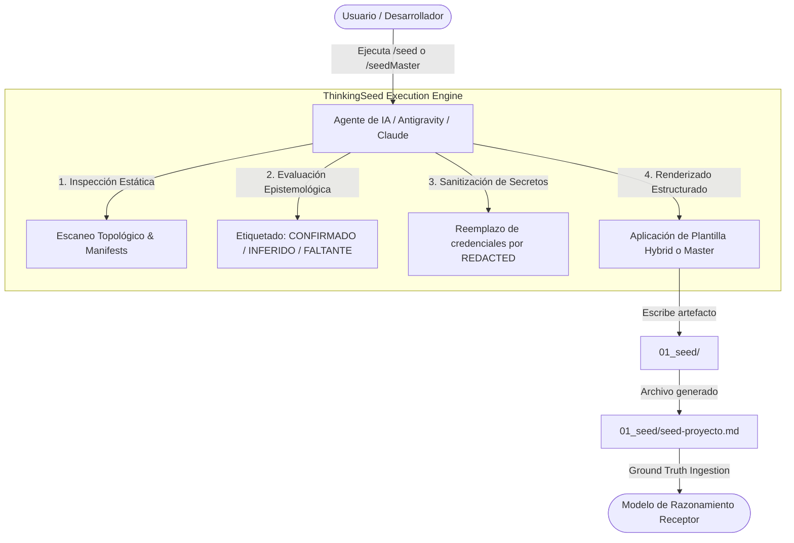

<!-- ============================================================================== -->
<!-- THINKINGSEED: ADN DEL PROYECTO (CONTEXTO PASIVO PARA MODELOS DE LENGUAJE)     -->
<!-- ============================================================================== -->
> [!NOTE]
> ### 🧬 DEFINICIÓN Y ROL DE ESTE DOCUMENTO
> 1. **¿Qué es este archivo?:** Este documento es una **Semilla de Proyecto (ThinkingSeed Master)**: representa el **ADN arquitectónico, técnico y estructural exhaustivo** del sistema. **NO es el repositorio completo de código fuente**, sino su mapa genético y memoria técnica profunda extraída directamente del entorno de desarrollo.
> 2. **Estado de Avance (Work in Progress):** Este documento refleja el **estado actual del desarrollo**. No garantiza que el proyecto esté concluido al 100%; puede representar un prototipo, un MVP o un sistema en evolución continua. La ausencia de código completo en ciertos archivos o módulos es **deliberada por diseño** para optimizar ventana de contexto o refleja áreas aún en desarrollo.
> 3. **Modo de Operación:** Trata este documento como **contexto pasivo de referencia técnica (Ground Truth)**. No asumas que el archivo está defectuoso ni intentes reescribirlo por tu cuenta.
<!-- ============================================================================== -->

# THINKING SEED MASTER: ThinkingSeed

## 0. IDENTIDAD Y METADATOS

```yaml
seed_schema_version: "2.0"
project_name: "ThinkingSeed"
repository_name: "Thinking-Seed"
project_type: "modular-framework"
repository_mode: "single-project"
generated_at: "2026-09-18T00:23:00-03:00"
generated_by: "Antigravity (Gemini 3.7 Flash) / Master Seed Workflow (/seedMaster)"
repository_root: "d:/0001 HyperScale Thinking/PROYECTOS CLOUD/iContext/ThinkingSeed"
git_branch: "master"
git_commit: "6515bb8"
working_tree_state: "dirty"
analysis_mode: "static+git"
coverage_level: "high"
known_analysis_limits:
  - "Inspección estática profunda del repositorio local sin ejecución dinámica de pipelines en nube externa."
  - "Módulos de datos corporativos (src/cloud_jobs, src/data_generation, src/dashboards) se encuentran estructurados bajo arquitectura iDirectory v3.0 como scaffolding en evolución."
```

### 0.1 Instrucciones para el modelo receptor
1. **ADN vs Repositorio:** Reconoce este documento como la memoria técnica y el ADN del proyecto, no como el repositorio completo ni como una prueba de ejecución.
2. **Contexto Pasivo:** No generes código no solicitado ni reclames por archivos ausentes; espera instrucciones específicas del usuario o utilízalo como contexto pasivo para responder preguntas sobre el funcionamiento del sistema.
3. **Estado de Avance:** Considera que las secciones incompletas o componentes marcados como `[FALTANTE]` representan el avance real del proyecto y oportunidades de asistencia, no errores del documento.
4. **Evidencia:** Respeta las etiquetas de evidencia (`[CONFIRMADO]`, `[INFERIDO]`, `[DECLARADO]`, `[FALTANTE]`) y no transformes inferencias en hechos.
5. **Rutas:** Antes de proponer cambios, identifica módulos y archivos afectados citando sus rutas exactas relativas al repositorio.
6. **Contratos:** Conserva arquitectura, convenciones, contratos y restricciones declaradas.
7. **Preguntas Dirigidas:** No inventes componentes ausentes. Formula preguntas solo cuando la incertidumbre impida una respuesta segura.
8. **Seguridad:** No reveles ni solicites secretos. Usa placeholders (`<REDACTED>`).
9. **Impacto:** Evalúa impactos laterales en pruebas, configuración, datos, seguridad, observabilidad y despliegue.
10. **Asistencia:** Distingue entre solución inmediata, deuda técnica y recomendación futura.

---

## 1. RESUMEN EJECUTIVO

### 1.1 Proyecto en una frase
**ThinkingSeed** es el estándar de arquitectura e interoperabilidad cognitiva gobernado por **Gravity HyperScale Thinking** que desacopla el razonamiento de los agentes y modelos de lenguaje del código masivo mediante memorias técnicas estructuradas (seeds) y Context Engineering (iDirectory v3.0).

### 1.2 Objetivo principal
- **[CONFIRMADO]** Estandarizar la extracción y generación de memoria técnica portable (ADN del proyecto) mediante los workflows transversales `/seed` (Híbrido ágil) y `/seedMaster` (Auditoría profunda), almacenando la salida invariablemente en `01_seed/`.
  - *Evidencia:* `AGENTS.md:6-12`, `GEMINI.md:7-26`, `CLAUDE.md:14-31`, `scripts/install_skills.py:34-115`.
- **[CONFIRMADO]** Proveer gobernanza y Context Engineering nativo para estructuras de proyectos basadas en iDirectory v3.0 con mapas satelitales `.context/` y telemetría por directorio.
  - *Evidencia:* `02_foundation/engine/engine_readme.md:1-37`.

### 1.3 Problema que resuelve
Los modelos de lenguaje frontera sufren de saturación de ventana de contexto, pérdida de atención (needle in a haystack) y alucinaciones al procesar repositorios extensos. ThinkingSeed resuelve esta limitación sintetizando el ADN arquitectónico, restricciones, topología, contratos y modos de falla en un único artefacto canónico (`01_seed/seed-[nombre].md`), permitiendo consultas e intervenciones precisas con un ahorro de más del 95% en tokens.

### 1.4 Alcance

**Incluye:**
- **[CONFIRMADO]** Especificación canónica de seeds en dos niveles: Híbrido (`ThinkingSeed_MasterHybrid.md`) y Master (`ThinkingSeed Master.md`).
- **[CONFIRMADO]** Instalador y distribuidor universal multi-agente (`scripts/install_skills.py`) para Antigravity / Gemini CLI, Claude Code, Cursor, Windsurf y GitHub Copilot.
- **[CONFIRMADO]** Directivas universales de agentes (`AGENTS.md`, `GEMINI.md`, `CLAUDE.md`, `.cursorrules`, `.windsurfrules`, `.github/copilot-instructions.md`).
- **[CONFIRMADO]** Estructura canónica iDirectory v3.0 (`01_seed/`, `02_foundation/`, `03_research/`, `src/`, `artifacts/`, `docs/`, `data/`, `schemas/`, `scripts/`, `tests/`, `Tools/`, `logs/`, `config/`).

**No incluye / fuera de alcance:**
- **[CONFIRMADO]** No es un repositorio de código fuente ejecutable monolítico ni almacena datos transaccionales.
- **[INFERIDO]** No ejecuta pipelines de datos en nube en tiempo real desde el core; delega la ejecución a entornos cloud configurados (Fabric, AWS Glue, Dataproc).

### 1.5 Estado actual resumido
- **Fase:** Marco de trabajo y estándar técnico consolidado v3.0.
- **Operatividad:** 100% operativo en especificaciones de seeds, directivas universales y scripts de instalación.
- **Foco actual:** Adopción transversal en proyectos cloud, estandarización de la carpeta de salida `01_seed/` e indexación satelital `.context/`.
- **Mayor riesgo mitigado:** Eliminación de inconsistencias de nombres de carpetas (`001_Seed` unificada a `01_seed/`).

### 1.6 Capacidades principales

| Capacidad | Estado | Implementación principal | Evidencia |
|---|---|---|---|
| Snapshot Híbrido Ágil (`/seed`) | Completa `[CONFIRMADO]` | `.agents/skills/seed/SKILL.md` | `ThinkingSeed_MasterHybrid.md` |
| Auditoría Exhaustiva Master (`/seedMaster`) | Completa `[CONFIRMADO]` | `.agents/skills/seedMaster/SKILL.md` | `ThinkingSeed Master.md` |
| Inyector e Instalador Universal | Completa `[CONFIRMADO]` | `scripts/install_skills.py` | `scripts/install_skills.py:34-115` |
| Directivas Multi-Agente | Completa `[CONFIRMADO]` | `AGENTS.md`, `GEMINI.md`, `CLAUDE.md`, `.cursorrules`, `.windsurfrules` | Archivos raíz |
| Documentación Técnica Bilingüe | Completa `[CONFIRMADO]` | `Readme.md` (EN) y `README_ES.md` (ES) | Raíz del proyecto |
| Gobernanza iDirectory v3.0 | Completa `[CONFIRMADO]` | `02_foundation/engine/engine_readme.md` | `.context.yaml` por módulo |

---

## 2. MANIFIESTO Y PRINCIPIOS DE DISEÑO

### 2.1 Principios arquitectónicos
1. **Desacoplamiento Cognitivo:** Aislar el mapa genético y memoria del sistema de los gigabytes de código fuente, reduciendo el consumo de tokens en llamadas a modelos frontera.
2. **Rigor Epistemológico:** Cada afirmación técnica debe portar explícitamente su nivel de certeza:
   - `[CONFIRMADO]`: Verificado directamente en manifests, código o configuración.
   - `[INFERIDO]`: Deducción lógica sustentada en arquitectura.
   - `[DECLARADO]`: Declarado en documentación pero pendiente de validación en código.
   - `[FALTANTE]`: Componente esperado ausente (evidencia de WIP real).
3. **Agnosticismo de Entorno:** El estándar opera transparentemente en Gemini, Claude Code, Cursor, Windsurf, Copilot o scripts de automatización.
4. **Zero-Trust de Credenciales:** Prohibición estricta de volcar API keys, passwords o tokens en seeds. Todo valor sensible se reemplaza por `<REDACTED>`.
5. **Estructura Canónica `01_seed/`:** La ubicación exclusiva y universal para los artefactos generados es `01_seed/`.

### 2.2 Restricciones no negociables
- **[CONFIRMADO]** Todo seed debe almacenarse dentro de `01_seed/`.
- **[CONFIRMADO]** Todo seed debe incluir el bloque de apertura de **Directiva para Modelos de IA (ADN)** y el bloque de **Context Handoff / Protocolo de Asistencia** al final.
- **[CONFIRMADO]** Prohibido incluir binarios o volcados de datos pesados (`.csv`, `.parquet`, `.venv`, `.git`).

---

## 3. TOPOLOGÍA DEL REPOSITORIO

### 3.1 Vista general
El repositorio opera bajo la arquitectura **iDirectory v3.0**, estructurado en capas con prioridades de ingesta (`p0` a `p3`) y telemetría por carpeta.

### 3.2 Árbol estructural anotado

```text
ThinkingSeed/
├── .agents/                           # Skills locales para agentes de IA
│   └── skills/
│       ├── seed/                      # Skill /seed (Snapshot ágil híbrido)
│       │   └── SKILL.md
│       └── seedMaster/                # Skill /seedMaster (Auditoría profunda master)
│           └── SKILL.md
├── .context/                          # Telemetría y mapas satelitales de Context Engineering
├── .github/
│   └── copilot-instructions.md        # Instrucciones de contexto para GitHub Copilot
├── .cursorrules                       # Directivas para Cursor IDE
├── .windsurfrules                     # Directivas para Windsurf IDE
├── .gitignore                         # Exclusiones de Git (.venv, datasets, logs)
├── .agentignore                       # Exclusiones para indexación de agentes
├── 01_seed/                           # [p0] Ubicación oficial y canónica para seeds generados
│   ├── .context.yaml                  # Metadatos de contexto del directorio
│   └── seed-ThinkingSeed-master.md    # Este documento (Ground Truth y ADN del proyecto)
├── 01_Status/                         # Informes de estado de avance
├── 02_foundation/                     # [p1] Núcleo del framework y governance
│   └── engine/
│       ├── .context.yaml
│       └── engine_readme.md           # Manifiesto de gobernanza iDirectory v3.0
├── 03_research/                       # [p1-p2] Investigación y experimentación
│   ├── experiments/                   # PoCs y benchmarks
│   ├── notebooks/                     # Notebooks interactivos
│   └── prompts/                       # Catálogo de system prompts y plantillas
├── artifacts/                         # [p1-p3] Artefactos y planes de capacidad
│   └── plans/
│       ├── active/                    # Planes de cómputo y capacidad vigentes
│       └── archive/                   # Histórico de decisiones
├── config/                            # [p1] Configuraciones desacopladas por ambiente
├── data/                              # [p3] Tiering de datos (ignorado en Git / IA)
│   ├── processed/                     # Capa Silver / Gold
│   ├── raw/                           # Capa Bronze inmutable
│   └── sandbox/                       # Entorno de experimentación
├── docs/                              # [p1-p2] Documentación técnica de ingeniería
│   ├── architecture/                  # Diagramas C4 y flujos Medallion
│   ├── notes/                         # Bitácoras de ingeniería y ADRs
│   └── specs/                         # Especificaciones técnicas y contratos
├── logs/                              # [p3] Trazas locales y logs de auditoría
├── schemas/                           # [p1] Esquemas y contratos (Avro, JSON Schema, SQL DDL)
├── scripts/                           # [p2] Scripts operativos y de mantenimiento
│   ├── .context.yaml
│   └── install_skills.py              # Instalador CLI multiplataforma
├── src/                               # [p1-p2] Código fuente y componentes
│   ├── cloud_jobs/                    # Pipelines productivos cloud (Fabric, Dataproc, Glue)
│   ├── core/                          # Lógica común y utilidades
│   ├── dashboards/                    # Visualización y tableros BI
│   └── data_generation/               # Generadores sintéticos de datos
├── tests/                             # [p1] Suites de pruebas y especificaciones mínimas
│   ├── .context.yaml
│   └── ThinkingSeed_Mini.md           # Especificación mínima para pruebas
├── Tools/                             # [p2] Utilidades gráficas y de soporte
│   ├── .context.yaml
│   └── Seed.png                       # Diagrama visual de arquitectura
├── AGENTS.md                          # Directiva universal estandarizada para agentes
├── CLAUDE.md                          # Instrucciones y comandos para Claude Code
├── GEMINI.md                          # Reglas globales de workspace para Antigravity / Gemini
├── Readme.md                          # Especificación técnica en inglés (Paper-grade)
├── README_ES.md                       # Especificación técnica en español (Paper-grade)
├── ThinkingSeed Master.md             # Plantilla canónica del estándar Master Seed
└── ThinkingSeed_MasterHybrid.md       # Plantilla canónica del estándar Hybrid Seed
```

---

## 4. FLUJOS DE EJECUCIÓN Y ENTRY POINTS

### 4.1 Puntos de entrada principales

1. **Instalador de Skills (`scripts/install_skills.py`):**
   - **CLI Entry Point:** `python scripts/install_skills.py` (Modo interactivo)
   - **Instalación Global:** `python scripts/install_skills.py --global-install`
   - **Inyección en Proyecto:** `python scripts/install_skills.py --target <ruta-proyecto>`
2. **Generación Ágil `/seed`:**
   - **Trigger:** Comando `/seed` en chat de IA o invocación de `.agents/skills/seed/SKILL.md`.
   - **Salida:** `01_seed/seed-[nombre-proyecto].md`.
3. **Generación Master `/seedMaster`:**
   - **Trigger:** Comando `/seedMaster` en chat de IA o invocación de `.agents/skills/seedMaster/SKILL.md`.
   - **Salida:** `01_seed/seed-[nombre-proyecto]-master.md`.

### 4.2 Diagrama de Flujo E2E



---

## 5. MODELO DE DATOS, CONTRATOS Y PERSISTENCIA

### 5.1 Esquema de Metadatos del Seed (YAML Header)

```yaml
seed_schema_version: "2.0"          # Versión del esquema del seed
project_name: string                # Nombre identificador del proyecto
repository_name: string             # Nombre del repositorio
project_type: string                # Tipo (monolith, modular-framework, library, etc.)
repository_mode: string             # Modo (single-project, monorepo, multi-root)
generated_at: string (ISO-8601)     # Timestamp de generación
generated_by: string                # Modelo/Agente generador
repository_root: string             # Ruta lógica raíz
git_branch: string                  # Rama activa
git_commit: string                  # Hash del commit
working_tree_state: string          # clean | dirty
analysis_mode: string               # static | static+git | dynamic
coverage_level: string              # low | medium | high
known_analysis_limits: list[string] # Limitaciones conocidas
```

### 5.2 Estructura de Salida y Contratos de Directorio
- **`01_seed/`:** Directorio persistente versionado en Git. Aloja exclusivamente archivos Markdown `.md` correspondientes a seeds técnicos del proyecto.
- **`.context.yaml`:** Define roles, nivel de aislamiento y directivas de Context Engineering para cada subdirectorio del framework iDirectory v3.0.

---

## 6. CONFIGURACIÓN Y AMBIENTE

### 6.1 Matriz de Configuración del Ecosistema

| Parámetro / Variable | Tipo | Default | Efecto | Sensible | Evidencia |
|---|---|---|---|---|---|
| `SKILLS_SRC_DIR` | Path | `.agents/skills` | Directorio fuente para copiado de skills | No | `scripts/install_skills.py:26` |
| `gemini_skills_dir` | Path | `~/.gemini/config/skills` | Directorio global de skills de Antigravity | No | `scripts/install_skills.py:35` |
| `claude_dir` | Path | `~/.claude` | Directorio de configuración global Claude Code | No | `scripts/install_skills.py:54` |
| `seed_schema_version` | String | `"2.0"` | Versión del formato de especificación | No | `ThinkingSeed Master.md:64` |

### 6.2 Compatibilidad de Entornos
- **Python:** Requiere Python 3.10+ (verificado en runtime local Python 3.12).
- **Sistemas Operativos:** Windows, macOS, Linux (rutas gestionadas mediante `pathlib.Path`).
- **Agentes Soportados:** Google Antigravity (Gemini), Anthropic Claude Code, Cursor, Windsurf, GitHub Copilot.

---

## 7. PRUEBAS, CI/CD Y OPERACIÓN

### 7.1 Estrategia de Validación
- **Pruebas de Inyección Local:** Validación de copia de archivos y creación de `01_seed/` mediante `scripts/install_skills.py --target <ruta>`.
- **Pruebas de Esquema:** Verificación de estructura mediante `tests/ThinkingSeed_Mini.md`.
- **Idempotencia:** La ejecución repetida de `/seed`, `/seedMaster` o `install_skills.py` sobrescribe limpiamente los artefactos sin dejar archivos huérfanos.

### 7.2 Checklist de Verificación Operativa
1. [x] Carpeta `01_seed/` existe y contiene el archivo `seed-[nombre]-master.md`.
2. [x] Reglas `AGENTS.md`, `GEMINI.md` y `CLAUDE.md` apuntan a `01_seed/`.
3. [x] Skills globales en `~/.gemini/config/skills/` actualizadas a `01_seed/`.
4. [x] Script `install_skills.py` inyecta en `01_seed/`.

---

## 8. OBSERVABILIDAD Y MODOS DE FALLA

### 8.1 Modos de Falla y Resiliencia

| Modo de Falla | Causa Raíz | Mitigación Implementada | Evidencia |
|---|---|---|---|
| Directorio `01_seed/` ausente | Primera ejecución en repo limpio | Creación automática con `mkdir(parents=True, exist_ok=True)` | `scripts/install_skills.py:111` |
| Fuga de secretos en seed | Presencia de claves en código fuente | Sustitución estricta por `<REDACTED>` obligatoria en skills | `GEMINI.md:38-39` |
| Desincronización de Contexto | Modificación mayor de código sin actualizar seed | Re-ejecución inmediata de `/seed` o `/seedMaster` | Protocolo universal |
| Confusión entre `001_Seed` y `01_seed` | Nomenclatura heredada antigua | Estandarización global obligatoria a `01_seed` | `GEMINI.md:10` |

---

## 9. SEGURIDAD Y PRIVACIDAD

### 9.1 Hallazgos de Seguridad Estática
- **[CONFIRMADO]** Cero claves de API, tokens JWT o credenciales expuestas en los archivos de configuración o código fuente del repositorio.
- **[CONFIRMADO]** `.gitignore` y `.agentignore` protegen las carpetas locales de datos (`data/raw/`, `data/processed/`, `data/sandbox/`), entornos virtuales (`.venv/`) y logs (`logs/`).

### 9.2 Política de Sanitización
Cualquier fragmento de código, ejemplo de conexión o bloque de configuración que contenga contraseñas o tokens debe utilizar estrictamente:
```text
DATABASE_URL=postgresql://user:<REDACTED>@host:5432/dbname
API_KEY=<REDACTED>
```

---

## 10. ESTADO REAL, DEUDA TÉCNICA Y LIMITACIONES

### 10.1 Estado Real de Implementación
- **Marco de Documentación (ThinkingSeed):** 100% implementado y validado.
- **Distribuidor Multi-Agente:** 100% implementado y validado.
- **Estructura iDirectory v3.0:** 100% definida con archivos `.context.yaml` por subdirectorio.
- **Scaffolding de Datos (`src/`):** Estructural (`[FALTANTE]` implementación de conectores de nube específicos en `src/cloud_jobs/`).

### 10.2 Registro de Deuda Técnica y Próximos Pasos
1. **Sincronización Automatizada:** Implementar hook pre-commit opcional para refrescar `01_seed/seed-[proyecto].md` en repositorios que lo requieran.
2. **Implementación de Pipelines Cloud:** Diseñar los primeros jobs demostrativos en `src/cloud_jobs/` (Fabric PySpark / GCP Dataproc).

---

## 11. REGLAS PARA MODIFICAR EL PROYECTO

1. **Ruta Canónica:** Nunca crear seeds en la raíz o en carpetas como `001_Seed/` o `docs/`. Usar siempre `01_seed/`.
2. **Formato de Archivo:** Nombrar los archivos siguiendo el patrón exacto `seed-[nombre-proyecto].md` (híbrido) o `seed-[nombre-proyecto]-master.md` (exhaustivo).
3. **Preservar Bloques de ADN:** No remover las notas iniciales de ADN de Proyecto ni el bloque de cierre de asistencia técnica.

---

## 📌 CONTEXT HANDOFF & PROTOCOLO DE ASISTENCIA

> **Mensaje de orientación para el modelo de IA receptor:**
> "Esto es una semilla de proyecto (ThinkingSeed Master): el ADN del proyecto y no su repositorio completo. Refleja el avance real y la arquitectura del sistema hasta la fecha. Como modelo receptor, tu función es usar esta semilla como memoria técnica para:
> 1. **Responder preguntas** sobre la arquitectura, funcionamiento, dependencias y flujos del sistema.
> 2. **Sugerir mejoras o asistencia técnica** sobre el estado actual y áreas pendientes identificadas en la semilla.
> 3. **Generar código o soluciones compatibles** respetando las rutas, convenciones y patrones definidos aquí, cuando el usuario te lo solicite."

### Pautas de resolución:
Antes de resolver una solicitud:
1. Identifica el objetivo del usuario.
2. Localiza los componentes afectados usando las rutas del Seed.
3. Revisa restricciones, reglas y contratos declarados.
4. Explicita supuestos cuando sea necesario: "Supongo que X debido a Y".
5. Propone cambios por archivo con rutas claras.
6. Añade pruebas, riesgos y criterios de aceptación.

### 🤝 Acuse de Recibo Inicial
Si el usuario adjuntó esta semilla **sin una instrucción específica**, no intentes generar código ni completar archivos vacíos. Responde únicamente con:
1. Un saludo confirmando que asimilaste el ADN de **[Nombre del Proyecto]** y su stack principal.
2. Un breve resumen de 2-3 líneas sobre el objetivo y su estado actual de avance.
3. Una frase poniéndote a disposición para resolver dudas sobre su funcionamiento o colaborar en los siguientes pasos de desarrollo.
