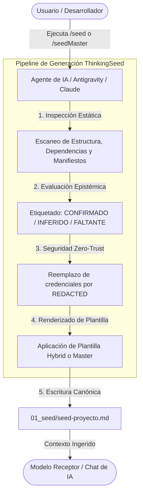

<!-- ============================================================================== -->
<!-- THINKINGSEED: ADN DEL PROYECTO (CONTEXTO PASIVO PARA MODELOS DE LENGUAJE)     -->
<!-- ============================================================================== -->
> [!NOTE]
> ### 🧬 DEFINICIÓN Y ROL DE ESTE DOCUMENTO
> 1. **¿Qué es este archivo?:** Este documento es una **Semilla de Proyecto (ThinkingSeed)**: representa el **ADN arquitectónico, técnico y estructural** del sistema. **NO es el repositorio completo de código fuente**, sino su mapa genético y memoria técnica de alta fidelidad extraída del entorno de desarrollo.
> 2. **Estado de Avance (Work in Progress):** Este documento refleja el **estado actual del desarrollo**. No garantiza que el proyecto esté 100% terminado; puede representar un proyecto en curso, un MVP o una arquitectura en expansión. Que no aparezca el código de todos los archivos es **deliberado por diseño** para optimizar la ventana de contexto.
> 3. **Modo de Operación:** Trata este documento como **contexto pasivo de referencia técnica (Ground Truth)**. No asumas que el archivo está defectuoso ni intentes reescribirlo por tu cuenta.
<!-- ============================================================================== -->

# MASTER HYBRID SEED: ThinkingSeed

> **Propósito:** Snapshot técnico, verificable y portable (ADN del proyecto).
> **Instrucción al Agente Generador:** Actúa como Arquitecto de Software Senior. Inspecciona el repo y llena este documento respetando las etiquetas de evidencia y la política de seguridad.

## 0. REGLAS DE GENERACIÓN (Epistemología y Seguridad)
*   **Etiquetas de Evidencia:** Toda afirmación técnica porta explícitamente su nivel de certeza:
    *   `[CONFIRMADO]`: Observado directamente en código, archivos o manifiestos.
    *   `[INFERIDO]`: Deducción lógica sustentada en arquitectura.
    *   `[FALTANTE]`: Componente o configuración esperable aún no presente.
*   **Política de Seguridad:** **PROHIBIDO** reproducir credenciales, secretos, API keys o tokens. Todo valor sensible se reemplaza estrictamente por `<REDACTED>`.

---

## 1. CORE MANIFESTO

### 1.1 Objetivo Principal
- **[CONFIRMADO]** Estandarizar la extracción y estructuración de la memoria técnica y arquitectónica de proyectos de software y cloud en semillas portables (`01_seed/seed-[proyecto].md`), desacoplando el razonamiento de los LLMs del volumen masivo de código fuente.
- **[CONFIRMADO]** Proporcionar dos workflows estandarizados: `/seed` (Híbrido ágil condensado) y `/seedMaster` (Auditoría profunda exhaustiva).

### 1.2 Problema que Resuelve
- **[CONFIRMADO]** Elimina la saturación de ventana de contexto en modelos de lenguaje frontera provocada por la ingesta de repositorios completos.
- **[CONFIRMADO]** Facilita la comprensión instantánea de arquitecturas complejas a personas y stakeholders no técnicos, reduciendo el consumo de tokens en más de un 95%.
- **[CONFIRMADO]** Resuelve la inconsistencia histórica de nombres unificando la ruta de persistencia exclusivamente en `01_seed/`.

### 1.3 Patrón Arquitectónico
- **[CONFIRMADO]** **Modular Architecture & Context Engineering (iDirectory v3.0)**: Organización por capas funcionales priorizadas (`p0` a `p3`), directivas locales `.context.yaml` y separación estricta entre memoria técnica (`01_seed/`), gobernanza (`02_foundation/`), investigación (`03_research/`) y componentes ejecutables (`src/`).

### 1.4 Stack Principal
- **[CONFIRMADO] Runtime:** Python 3.10+ (verificado en Python 3.12 local).
- **[CONFIRMADO] Formatos de Datos:** Markdown (`.md`), YAML (`.yaml`), JSON (`.json`), Mermaid.
- **[CONFIRMADO] Distribución e Instalación:** `scripts/install_skills.py` (script nativo en Python usando bibliotecas estándar `pathlib`, `sys`, `shutil`, `os`).
- **[CONFIRMADO] Integración de Agentes:** Soporte nativo para Google Antigravity (Gemini), Anthropic Claude Code, Cursor IDE, Windsurf IDE y GitHub Copilot.

---

## 2. REPOSITORY TOPOLOGY

```text
ThinkingSeed/
├── .agents/                           # [p0] Skills locales para agentes de IA
│   └── skills/
│       ├── seed/                      # Skill /seed (Snapshot ágil híbrido)
│       │   └── SKILL.md
│       └── seedMaster/                # Skill /seedMaster (Auditoría profunda exhaustiva)
│           └── SKILL.md
├── .context/                          # Telemetría satelital y Context Engineering
├── .github/
│   └── copilot-instructions.md        # Instrucciones de contexto para GitHub Copilot
├── .cursorrules                       # Directivas para Cursor IDE
├── .windsurfrules                     # Directivas para Windsurf IDE
├── .gitignore                         # Exclusiones de Git (.venv, datasets, logs)
├── .agentignore                       # Exclusiones de contexto para agentes
├── 01_seed/                           # [p0] Directorio canónico universal para seeds
│   ├── .context.yaml                  # Metadatos del directorio
│   ├── seed-ThinkingSeed.md           # Este documento (Snapshot Híbrido Ágil)
│   └── seed-ThinkingSeed-master.md    # Snapshot exhaustivo (Master Seed)
├── 01_Status/                         # Informes de avance y trazabilidad
├── 02_foundation/                     # [p1] Gobernanza iDirectory v3.0
│   └── engine/
│       ├── .context.yaml
│       └── engine_readme.md           # Manifiesto de gobernanza
├── 03_research/                       # [p1-p2] Investigación, experimentos y prompts
│   ├── experiments/                   # PoCs y benchmarks
│   ├── notebooks/                     # Notebooks de análisis
│   └── prompts/                       # Catálogo de prompts
├── artifacts/                         # [p1-p3] Planes de capacidad vigentes e históricos
├── config/                            # [p1] Configuraciones por entorno
├── data/                              # [p3] Tiering de datos (Bronze / Silver / Gold - excluido de Git/IA)
├── docs/                              # [p1-p2] Documentación de ingeniería y arquitectura C4
├── logs/                              # [p3] Trazas y auditoría
├── schemas/                           # [p1] Esquemas y contratos de datos
├── scripts/                           # [p2] Scripts operativos y utilidades
│   ├── .context.yaml
│   └── install_skills.py              # Instalador CLI multiplataforma
├── src/                               # [p1-p2] Código fuente y scaffolding
│   ├── cloud_jobs/                    # Scaffolding pipelines cloud (Fabric, Dataproc, Glue)
│   ├── core/                          # Utilidades comunes
│   ├── dashboards/                    # Visualización
│   └── data_generation/               # Generación sintética
├── tests/                             # [p1] Suites de pruebas y especificaciones mínimas
│   ├── .context.yaml
│   └── ThinkingSeed_Mini.md           # Especificación mínima para pruebas
├── Tools/                             # [p2] Herramientas de soporte visual
│   ├── .context.yaml
│   └── Seed.png                       # Diagrama visual de arquitectura
├── AGENTS.md                          # Directiva universal para agentes autónomos
├── CLAUDE.md                          # Instrucciones y comandos para Claude Code
├── GEMINI.md                          # Reglas globales de workspace para Antigravity/Gemini
├── Readme.md                          # Especificación técnica en inglés (Paper-grade)
├── README_ES.md                       # Especificación técnica en español (Paper-grade)
├── ThinkingSeed Master.md             # Plantilla canónica del estándar Master Seed
└── ThinkingSeed_MasterHybrid.md       # Plantilla canónica del estándar Hybrid Seed
```

---

## 3. EXECUTION FLOW

### 3.1 Flujo E2E de Generación de Semillas



### 3.2 Entry Points
1. **Comando `/seed`:** Genera un snapshot híbrido ágil `01_seed/seed-[proyecto].md` enfocado en transferencia ultraligera y alta densidad.
2. **Comando `/seedMaster`:** Genera un snapshot exhaustivo `01_seed/seed-[proyecto]-master.md` para auditorías técnicas profundas y migraciones.
3. **CLI `scripts/install_skills.py`:**
   - Modo interactivo: `python scripts/install_skills.py`
   - Inyección en proyecto destino: `python scripts/install_skills.py --target <ruta>`
   - Instalación global en perfil de usuario: `python scripts/install_skills.py --global-install`

### 3.3 Flujo de Datos y Persistencia
- **[CONFIRMADO] Origen:** Inspección estática del workspace, archivos de configuración y manifiestos.
- **[CONFIRMADO] Transformación:** Compresión contextual preservando el ADN arquitectónico.
- **[CONFIRMADO] Persistencia:** Exclusivamente en la carpeta `01_seed/` del proyecto destino.

---

## 4. CURRENT STATE & RULES

### 4.1 Foco Actual y Estado de Madurez
- **[CONFIRMADO]** Framework en versión **3.0 estable**.
- **[CONFIRMADO]** Directivas transversales (`AGENTS.md`, `GEMINI.md`, `CLAUDE.md`, `.cursorrules`, `.windsurfrules`) 100% alineadas al estándar `01_seed/`.
- **[INFERIDO]** Fase actual enfocada en la distribución, testing de cobertura porcentual de seeds y adopción en proyectos de datos y nube de la organización.

### 4.2 Reglas de Código y Convenciones
- **Rigor Epistémico:** Cada dato o afirmación debe portar `[CONFIRMADO]`, `[INFERIDO]` o `[FALTANTE]`.
- **Zero-Trust Secrets:** Prohibición estricta de credenciales en seeds; uso obligatorio de `<REDACTED>`.
- **Persistencia Única:** Todo seed generado debe almacenarse invariablemente en `01_seed/`.
- **Convenciones Python:** Código modular con `pathlib` para garantizar portabilidad Windows / Linux / macOS.

---

## 5. ECOSYSTEM CONTEXT

- **[CONFIRMADO] Ecosistema Gravity / HyperScale Thinking:** Marco global de ingeniería que gobierna proyectos satélite de datos e inteligencia artificial.
- **[CONFIRMADO] Integración Multi-Agente:** Compatibilidad comprobada con Antigravity (Gemini), Claude Code, Cursor, Windsurf y GitHub Copilot.
- **[CONFIRMADO] Framework iDirectory v3.0:** Mapeo de directorios con directivas de Context Engineering mediante archivos locales `.context.yaml`.

---

## 6. CONFIGURATION REFERENCE

| Variable / Parámetro | Tipo | Default | Efecto | Sensible | Evidencia |
|---|---|---|---|---|---|
| `SKILLS_SRC_DIR` | Path | `.agents/skills` | Directorio origen de skills para el instalador | No | `scripts/install_skills.py:26` `[CONFIRMADO]` |
| `gemini_skills_dir` | Path | `~/.gemini/config/skills` | Destino global de skills para Antigravity | No | `scripts/install_skills.py:35` `[CONFIRMADO]` |
| `claude_dir` | Path | `~/.claude` | Destino de configuración global para Claude Code | No | `scripts/install_skills.py:54` `[CONFIRMADO]` |
| `seed_schema_version` | String | `"2.0"` | Versión del esquema del seed | No | `ThinkingSeed Master.md:64` `[CONFIRMADO]` |

---

## 7. SEGURIDAD, RIESGOS Y FAILURE MODES

### 7.1 Hallazgos de Seguridad Estática
- **[CONFIRMADO]** No existen secretos, credenciales ni claves privadas registradas en el repositorio.
- **[CONFIRMADO]** Filtros activos en `.gitignore` y `.agentignore` impiden la fuga accidental de entornos locales o datos transaccionales.

### 7.2 Modos de Falla y Mitigaciones
- **Carpeta `01_seed/` no existente:** El script y los workflows la crean automáticamente (`mkdir -p`) antes de persistir.
- **Desincronización de ADN:** Ante cambios de arquitectura mayores, se regenera el seed invocando nuevamente `/seed` o `/seedMaster`.
- **Nomenclatura heredada:** Mitigada al consolidar de forma universal el uso de `01_seed/` en todas las reglas y skills.

### 7.3 Riesgos Técnicos y Deuda
- **[CONFIRMADO]** La suite de tests ejecutables unitarios aún está en fase de formalización en `tests/` (`ThinkingSeed_Mini.md` define la especificación mínima pero no automatizada).

---

## 8. SECCIONES OPCIONALES

### 8.1 Matriz de Comparación: `/seed` vs `/seedMaster`

| Característica | `/seed` (Hybrid) | `/seedMaster` (Master) |
|---|---|---|
| **Archivo de salida** | `01_seed/seed-[proyecto].md` | `01_seed/seed-[proyecto]-master.md` |
| **Tamaño promedio** | 2k – 6k tokens | 10k – 30k tokens |
| **Enfoque** | Agilidad, alta densidad y portabilidad | Auditoría profunda y exhaustividad |
| **Casos de uso** | Contexto para chats de IA y agentes de desarrollo | Auditorías completas, migraciones y refactorings |
| **Ahorro de Tokens** | **>97%** | **~90%** |

---

## 9. CONTEXT HANDOFF & PROTOCOLO DE ASISTENCIA (Para el Modelo Receptor)

> **Orientación para el modelo de IA lector:**
> "Este documento es una semilla técnica: el ADN del proyecto y no su repositorio completo. Refleja la arquitectura y el avance real hasta la fecha. Como modelo receptor, utiliza esta semilla como memoria de trabajo para:
> 1. **Responder preguntas** sobre la arquitectura, funcionamiento, dependencias y flujos del sistema.
> 2. **Sugerir mejoras o asistencia técnica** basadas en el estado actual y áreas pendientes identificadas.
> 3. **Generar código o soluciones compatibles** respetando las rutas, convenciones y patrones definidos aquí, cuando el usuario te lo solicite."

### Directrices de interacción para la IA receptora:
1. **Entender:** Identificar el objetivo y los componentes afectados antes de proponer código.
2. **Validar:** Si falta información crítica, preguntar puntualmente en vez de alucinar.
3. **Citar Rutas:** Usar las rutas de archivo declaradas en la topología al sugerir modificaciones.
4. **Respetar:** Mantener el stack, contratos y restricciones de seguridad.
5. **Acuse de Recibo Inicial:** Si el usuario adjuntó esta semilla sin una pregunta concreta, responde en máximo 3 líneas resumiendo el nombre del proyecto, stack y objetivo, confirmando que has asimilado el ADN del proyecto y quedando a la espera de sus consultas o tareas.
